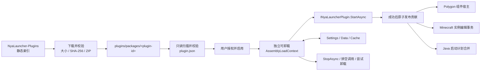
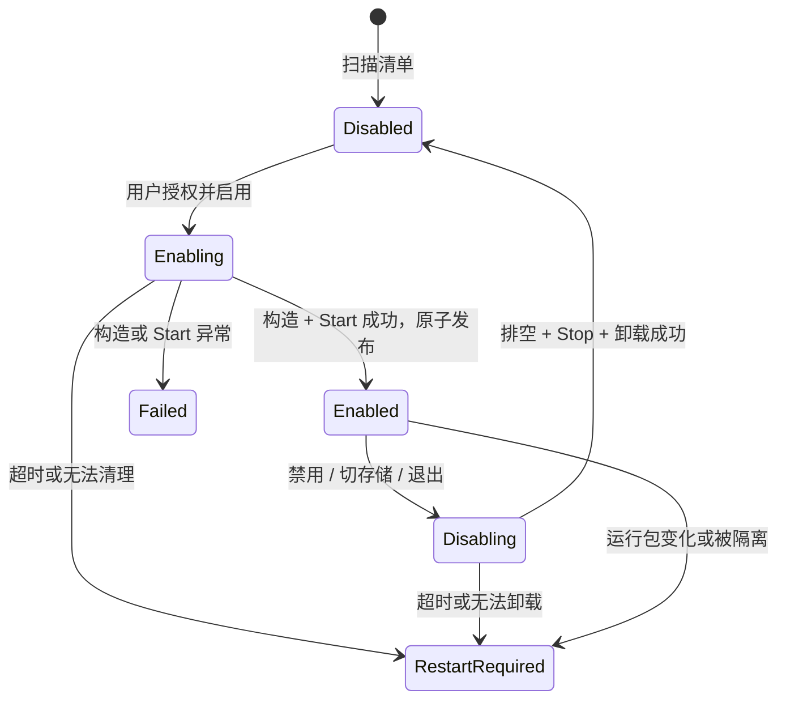

# NyaLauncher 第三方插件开发手册（API v1）

本文面向第三方插件开发者。按照本文即可完成插件的创建、调试、测试、打包、发布和更新，
无需阅读 NyaLauncher 宿主源码。

| 适用项 | 当前值 |
| --- | --- |
| SDK | `NyaLauncher.Plugin.Abstractions` `0.1.0-ppre.1` |
| 目标框架 | `.NET 10` / `net10.0` |
| CLR 程序集版本 | `1.0.0.0`（API v1 内保持稳定） |
| 运行时清单 | `manifestVersion: 1` |
| 插件 API | `apiVersion: "1.0"` |
| 插件中心 | [TouristH/NyaLauncher-Plugins](https://github.com/TouristH/NyaLauncher-Plugins) |
| 完整示例 | [NyaLauncher.Clock](../examples/NyaLauncher.Clock/README.md) |

> **安全警告：**插件 DLL 与启动器运行在同一进程。能力授权只约束部分宿主 API 并记录用户同意，
> 不是操作系统沙箱；`AssemblyLoadContext` 也只负责依赖隔离和尝试卸载。插件仍能直接调用 .NET 的
> 文件、网络、进程和系统 API。只安装可信来源的插件，并独立审查源码、依赖和每次更新。

## 目录

1. [插件系统概述](#1-插件系统概述)
2. [快速开始：Hello World](#2-快速开始hello-world)
3. [工程结构与清单文件](#3-工程结构与清单文件)
4. [核心 API 参考](#4-核心-api-参考)
5. [扩展点与贡献点](#5-扩展点与贡献点)
6. [插件生命周期](#6-插件生命周期)
7. [数据访问与存储](#7-数据访问与存储)
8. [权限与安全](#8-权限与安全)
9. [日志、错误处理与调试](#9-日志错误处理与调试)
10. [开发工具与 CLI](#10-开发工具与-cli)
11. [测试指南](#11-测试指南)
12. [打包、发布与更新](#12-打包发布与更新)
13. [版本兼容与迁移](#13-版本兼容与迁移)
14. [最佳实践与设计指南](#14-最佳实践与设计指南)
15. [示例与模板](#15-示例与模板)
16. [常见问题与故障排除](#16-常见问题与故障排除)
17. [法律、隐私与分发说明](#17-法律隐私与分发说明)

---

## 1. 插件系统概述

### 1.1 能做什么

API v1 提供四类公开能力：

- 声明并运行完全自定义的 Polygon 工作区组件，包括文本、进度、图片、按钮、下拉菜单、文本输入、
  开关和滑块，可制作电子钟、图片框、在线音乐控制器、AI 前端和状态面板。
- 声明由宿主渲染、校验并保存的全局或 Minecraft 实例设置。
- 向版本详情页注册用户主动执行的实例动作，并通过受控文件事务持久修改 Minecraft 实例。
- 在每次游戏启动前声明式修改 classpath、main class、Java、工作目录、参数和环境变量。

实例动作和启动贡献可以组合成一套**由插件作者自行定义规范的新模组加载器**：插件安装作者自己的
Java 加载器、清单与模组文件，再在启动时切换到作者自己的 main class。它不依赖 Forge、Fabric、
NeoForge、Quilt 或其他既有加载器；NyaLauncher 也不会替作者解析其模组格式或依赖关系。

### 1.2 当前不能做什么

API v1 当前不提供：

- 任意 Avalonia `Control`、任意页面或原生窗口注入；
- 宿主全局菜单、通用命令、编辑器、快捷键或工具栏扩展点；
- 插件间依赖解析、服务发现或稳定插件间调用协议；
- 运行中动态注册/撤销贡献；
- 通用 HTTP、日志、数据库、凭据库、进程或文件选择服务；
- 实例设置自动 UI、实例动作参数表单；
- 官方热重载、远程调试、CLI、脚手架、无头测试宿主或 IDE 插件；
- 对恶意插件的进程级安全隔离。

`ui.native`、`network.http` 等能力名不代表宿主已提供对应服务。当前
`IPluginContext.GetService<TService>()` 始终返回 `null`。

### 1.3 架构



扫描清单不会执行插件代码。只有用户完成必要授权并启用后，宿主才加载入口程序集；
`StartAsync` 全部成功后，注册项才一次性对外可见。

### 1.4 术语

| 术语 | 含义 |
| --- | --- |
| 宿主 | NyaLauncher，负责扫描、授权、加载、调用、保存和卸载。 |
| 插件包 | 一个目录或 ZIP；根目录包含 `plugin.json`。 |
| 运行时清单 | 包根 `plugin.json`，宿主在执行代码前读取。 |
| 发布清单 | 作者仓库根 `_manifest.json`，插件中心用它同步不可变发行历史。 |
| 入口 | `entryType` 指定的 `INyaLauncherPlugin` 实现。 |
| 能力 | 用户知情声明及部分宿主 API 的授权门槛。 |
| 注册窗口 | `StartAsync` 执行期间可调用 `IPluginRegistrar` 的时段。 |
| 实例动作 | 用户显式触发、可持久修改 Minecraft 实例的命令。 |
| 启动贡献 | 只影响本次游戏进程的启动计划变换。 |
| 休眠组件 | 插件禁用后保留布局和声明、但不再执行插件代码的占位组件。 |
| listed / 收录 | 通过格式、哈希和包结构验证；不等于安全审核。 |
| verified / 已审核 | 审核记录绑定指定 ID、版本和 ZIP SHA-256；仍不构成安全保证。 |

---

## 2. 快速开始：Hello World

### 2.1 环境

- 安装 [.NET 10 SDK](https://dotnet.microsoft.com/download/dotnet/10.0)。
- 语言基线为 **C# 14 / .NET 10**；示例和 SDK 公共契约均按该版本编写。
- 宿主支持 **Windows 10+、macOS Ventura+、Linux Kernel 5.0+**。纯托管 `AnyCPU` 插件通常可跨平台；
  使用原生库、系统命令或平台路径的插件须自行声明支持范围并逐平台测试。
- 使用支持 .NET 10 的 Visual Studio、Rider、VS Code 或 `dotnet` CLI。
- 从**与目标 NyaLauncher 相同版本**的发布包中取得
  `NyaLauncher.Plugin.Abstractions.dll`，通常与启动器可执行文件在同一输出目录。

当前没有官方 NuGet 包或 SDK 安装命令。外部项目只引用 SDK DLL，不要引用
`NyaLauncher.Avalonia`、`NyaLauncher.Core` 或宿主内部实现。

### 2.2 最小工程

```text
Example.Hello/
├─ sdk/NyaLauncher.Plugin.Abstractions.dll
├─ PluginEntry.cs
├─ plugin.json
└─ Example.Hello.csproj
```

`Example.Hello.csproj`：

```xml
<Project Sdk="Microsoft.NET.Sdk">
  <PropertyGroup>
    <TargetFramework>net10.0</TargetFramework>
    <ImplicitUsings>enable</ImplicitUsings>
    <Nullable>enable</Nullable>
    <AssemblyName>Example.Hello</AssemblyName>
  </PropertyGroup>
  <ItemGroup>
    <!-- Private=false：宿主提供 SDK，发行包中不得再带一份。 -->
    <Reference Include="NyaLauncher.Plugin.Abstractions">
      <HintPath>sdk/NyaLauncher.Plugin.Abstractions.dll</HintPath>
      <Private>false</Private>
    </Reference>
  </ItemGroup>
</Project>
```

`plugin.json`：

```json
{
  "manifestVersion": 1,
  "id": "dev.example.hello",
  "name": "Hello NyaLauncher",
  "version": "1.0.0",
  "apiVersion": "1.0",
  "minimumLauncherVersion": "0.1.1",
  "description": "最小可运行的 Polygon 组件插件。",
  "authors": ["Your Name"],
  "license": "MIT",
  "entryAssembly": "Example.Hello.dll",
  "entryType": "Example.Hello.PluginEntry",
  "requiredCapabilities": ["ui.components"],
  "optionalCapabilities": [],
  "settings": []
}
```

`PluginEntry.cs`：

```csharp
using NyaLauncher.Plugin.Abstractions.Components;
using NyaLauncher.Plugin.Abstractions.Plugins;

namespace Example.Hello;

public sealed class PluginEntry : PluginBase
{
    protected override ValueTask OnStartAsync(CancellationToken cancellationToken)
    {
        cancellationToken.ThrowIfCancellationRequested();

        var definition = new PolygonComponentBuilder(
                $"{Context.Manifest.Id}/hello", "Hello World")
            .WithDescription("来自第三方插件的第一个组件")
            .WithSize(300, 170)
            .AddText("message", new ComponentRect(0.08, 0.25, 0.84, 0.5),
                "Hello, NyaLauncher!", ComponentTextRole.Title, 22)
            .Build();

        Context.Registrar.AddComponentArea(new PluginComponentArea
        {
            Id = $"{Context.Manifest.Id}/area",
            Title = "Hello 插件",
            Subtitle = "快速开始示例",
            Components =
            [
                // Factory=null 是合法静态组件：显示声明，但没有运行时动作。
                new PolygonComponentRegistration { Definition = definition }
            ]
        });

        return ValueTask.CompletedTask;
    }
}
```

### 2.3 构建、加载和验证

```powershell
dotnet build .\Example.Hello.csproj -c Debug
```

1. 在启动器“插件列表”打开包目录。Windows 默认通常为
   `%LOCALAPPDATA%\NyaLauncher\plugins\packages`；自定义存储目录后位置随之改变，所以不要硬编码。
2. 新建 `dev.example.hello` 子目录，把 `plugin.json` 和
   `bin/Debug/net10.0/Example.Hello.dll` 放入其中。
3. 点击“重新扫描”；插件应显示为“已禁用”，不是“无效”。
4. 启用并确认 `ui.components`，再把 “Hello World” 从组件库拖入工作区。

修改代码后先禁用，再替换 DLL、重新扫描并启用。若显示“需要重启”，必须重启；API v1 不承诺热替换。

---

## 3. 工程结构与清单文件

### 3.1 推荐源码与安装结构

```text
MyPlugin/
├─ src/
│  ├─ PluginEntry.cs       # 仅生命周期和注册
│  ├─ Components/
│  ├─ Minecraft/
│  └─ Services/
├─ tests/
├─ assets/
├─ sdk/NyaLauncher.Plugin.Abstractions.dll
├─ plugin.json
├─ README.md
└─ LICENSE
```

```text
<当前配置存储目录>/plugins/
├─ packages/dev.example.toolbox/
│  ├─ plugin.json
│  ├─ Example.Toolbox.dll
│  ├─ Example.Dependency.dll
│  ├─ Example.Toolbox.deps.json
│  └─ assets/icon.png
├─ data/dev.example.toolbox/
│  ├─ settings.json
│  ├─ data/                 # IPluginStorage.DataDirectory
│  └─ cache/                # IPluginStorage.CacheDirectory
└─ state.json
```

宿主只扫描 `packages` 的一级子目录，最多 256 个包。每份 `plugin.json` 最大 1 MiB，必须是有效 UTF-8
JSON。包、入口、依赖和资源路径不得逃逸包根或穿过 symlink/junction/reparse point。

### 3.2 `plugin.json` 字段

属性名大小写不敏感，但统一使用 camelCase。`kind` 和 `scope` 必须写字符串枚举名；数字枚举会被拒绝。

| 字段 | 必需 | 规则 |
| --- | --- | --- |
| `manifestVersion` | 否 | 当前只能是整数 `1`。 |
| `id` | 是 | 小写反向域名、至少含一点、最长 128，例如 `dev.example.toolbox`；发布后不变。 |
| `name` | 是 | 非空，最长 256。 |
| `version` | 是 | 最长 64；发布统一使用严格 SemVer。 |
| `apiVersion` | 否 | 当前主版本必须为 `1`，推荐 `1.0`。 |
| `minimumLauncherVersion` | 否 | 使用新增 API 所需最低宿主；插件中心要求严格 SemVer。 |
| `description` | 否 | 最长 8192。 |
| `authors` | 否 | 最多 64 项，每项最长 256。 |
| `homepage` / `license` | 否 | 主页/隐私链接与许可证；推荐 SPDX 许可证 ID。 |
| `icon` | 否 | 包内相对路径；缺失或不可显示时回退 glyph。 |
| `entryAssembly` | 是 | 包内已存在的 `.dll` 相对路径。 |
| `entryType` | 是 | 非 abstract、实现入口接口且可由公共无参构造创建的**命名空间完整类型名**；推荐入口类型 public。不要写程序集限定名。 |
| `requiredCapabilities` | 否 | 缺一项授权就不能启动；未知必要能力会导致不兼容。 |
| `optionalCapabilities` | 否 | 拒绝后插件必须降级；两组合计最多 64 且不得重复。 |
| `settings` | 否 | 最多 256 项。扩展点不在清单声明，而在 `StartAsync` 注册。 |

清单没有插件依赖、菜单、快捷键或扩展点列表字段。

### 3.3 设置字段

| 字段 | 说明 |
| --- | --- |
| `key` | 必需；ASCII 字母开头，后续可用字母数字、`_`、`.`、`-`，最长 128，不区分大小写唯一。 |
| `title` / `description` | 用户可见名称和说明。 |
| `kind` | `Boolean`、`Integer`、`Number`、`Text`、`MultilineText`、`Secret`、`Choice`、`File`、`Directory`。 |
| `scope` | `Global` 或 `MinecraftInstance`；当前详情页只自动渲染 Global。 |
| `defaultValue` | JSON 类型须匹配；`File` / `Directory` 只能省略或为 `null`。 |
| `required` | 是否拒绝空值。 |
| `minimum` / `maximum` / `step` | 数值范围和正步长。 |
| `maximumLength` / `pattern` / `placeholder` | 文本限制、.NET 正则和提示。 |
| `options` | `Choice` 必需；每项有 `value`、`label`、可选 `description`。 |
| `fileExtensions` | `File` 后缀，含前导点，例如 `.png`。 |

完整示例见[附录 A](#附录-a完整-pluginjson)。

### 3.4 ID 与两种清单

| ID | 规则 |
| --- | --- |
| 插件 ID | 稳定的小写反向域名。 |
| 组件 ID | 必须恰好是 `<pluginId>/<local-id>`：只允许一个 `/`，总长最多 128；两段只用字母、数字、点、下划线、连字符。 |
| 实例扩展、启动贡献 ID | 必须以 `<pluginId>/` 开头，总长最多 256。 |
| 功能区 ID | 非空、同插件唯一；建议用 `<pluginId>/...`，但宿主不强制此前缀。 |
| 组件动作/元素/菜单项 ID | 最长 64，只用字母、数字、点、下划线、连字符；各自范围内不区分大小写唯一。 |
| 设置 key | 规则见 3.3；发布后视为持久兼容协议。 |

- 包根 `plugin.json` 是宿主运行时清单。
- 作者仓库根 `_manifest.json` 是插件中心发行历史清单，宿主不直接加载。
- 中心生成的历史 JSON 和 `public/v1/index.json` 不应打进插件 ZIP。

---

## 4. 核心 API 参考

除特别标注外，本节公共成员自 **API v1 / NyaLauncher 0.1.0-gp3** 起可用；
`ComponentStateSnapshot.Scale` 自 **0.1.1-gp3** 起可用。异步 API 应传播取消令牌；
不要把本地化异常文本当机器协议。

### 4.1 `NyaLauncher.Plugin.Abstractions.Plugins`

| 类型 | 主要用途 | 典型失败 | Since |
| --- | --- | --- | --- |
| `PluginManifest` | 运行时清单只读快照。 | 清单错误在执行代码前成为 Invalid/Incompatible。 | API v1 |
| `PluginCapabilities` | 十个标准能力字符串。 | 未知必要能力不兼容。 | API v1 |
| `INyaLauncherPlugin` | `StartAsync(context, ct)`、`StopAsync(ct)`。 | 异常会失败/隔离；启动失败不发布贡献。 | API v1 |
| `PluginBase` | 状态保护的 `Context`、`OnStartAsync`、`OnStopAsync`。 | 未启动访问 Context 抛 `InvalidOperationException`。 | API v1 |
| `IPluginContext` | Manifest、Storage、Settings、Registrar、能力和可选服务。 | 未实现服务返回 `null`。 | API v1 |
| `IPluginStorage` | Package/Data/Cache 与安全路径解析。 | 非法/越界/reparse 路径抛参数异常。 | API v1 |
| `IPluginRegistrar` | 注册三种贡献，仅 Start 期间开放。 | 能力不足、窗口关闭或定义无效。 | API v1 |
| `PluginComponentArea` | `Id/Title/Subtitle/Glyph/Icon/Components`。 | 注册时验证并深快照。 | API v1 |
| `PluginSettingKind`、`PluginSettingScope`、`PluginSettingOption`、`PluginSettingDefinition` | 设置枚举、Choice 选项和 schema。 | 清单扫描时校验。 | API v1 |
| `IPluginSettings`、`PluginSettingChangedEventArgs` | 强类型读写、重置和变化事件。 | 见下文。 | API v1 |

```csharp
public sealed record PluginManifest
{
    public const int CurrentManifestVersion = 1;
    public int ManifestVersion { get; init; } = 1;
    public required string Id { get; init; }
    public required string Name { get; init; }
    public required string Version { get; init; }
    public string ApiVersion { get; init; } = "1.0";
    public string? MinimumLauncherVersion { get; init; }
    public string Description { get; init; }
    public IReadOnlyList<string> Authors { get; init; }
    public string? Homepage { get; init; }
    public string? License { get; init; }
    public string? Icon { get; init; }
    public required string EntryAssembly { get; init; }
    public required string EntryType { get; init; }
    public IReadOnlyList<string> RequiredCapabilities { get; init; }
    public IReadOnlyList<string> OptionalCapabilities { get; init; }
    public IReadOnlyList<PluginSettingDefinition> Settings { get; init; }
}

public interface INyaLauncherPlugin
{
    ValueTask StartAsync(IPluginContext context, CancellationToken cancellationToken);
    ValueTask StopAsync(CancellationToken cancellationToken);
}

public abstract class PluginBase : INyaLauncherPlugin
{
    protected IPluginContext Context { get; }
    protected virtual ValueTask OnStartAsync(CancellationToken cancellationToken);
    protected virtual ValueTask OnStopAsync(CancellationToken cancellationToken);
}

public interface IPluginContext
{
    PluginManifest Manifest { get; }
    IPluginStorage Storage { get; }
    IPluginSettings Settings { get; }
    IPluginRegistrar Registrar { get; }
    bool IsCapabilityGranted(string capability);
    TService? GetService<TService>() where TService : class;
}

public interface IPluginStorage
{
    string PackageDirectory { get; }
    string DataDirectory { get; }
    string CacheDirectory { get; }
    string GetDataPath(string relativePath);
    string GetCachePath(string relativePath);
}

public interface IPluginRegistrar
{
    void AddComponentArea(PluginComponentArea contribution);
    void AddMinecraftInstanceExtension(IMinecraftInstanceExtension extension);
    void AddMinecraftLaunchContributor(IMinecraftLaunchContributor contributor);
}

public sealed record PluginComponentArea
{
    public required string Id { get; init; }
    public required string Title { get; init; }
    public string Subtitle { get; init; }
    public string Glyph { get; init; } = "◇";
    public string? Icon { get; init; } // 包相对路径
    public IReadOnlyList<PolygonComponentRegistration> Components { get; init; }
}

public interface IPluginSettings
{
    bool TryGet<T>(string key, out T? value, string? instanceId = null);
    T Get<T>(string key, T fallback, string? instanceId = null);
    ValueTask SetAsync<T>(string key, T value, string? instanceId = null,
        CancellationToken cancellationToken = default);
    ValueTask ResetAsync(string key, string? instanceId = null,
        CancellationToken cancellationToken = default);
    event EventHandler<PluginSettingChangedEventArgs>? Changed;
}

public enum PluginSettingKind
{
    Boolean, Integer, Number, Text, MultilineText, Secret, Choice, File, Directory
}

public enum PluginSettingScope { Global, MinecraftInstance }

public sealed record PluginSettingOption(string Value, string Label)
{
    public string Description { get; init; }
}

public sealed record PluginSettingDefinition
{
    public required string Key { get; init; }
    public required string Title { get; init; }
    public string Description { get; init; }
    public PluginSettingKind Kind { get; init; }
    public PluginSettingScope Scope { get; init; }
    public JsonElement? DefaultValue { get; init; }
    public bool Required { get; init; }
    public double? Minimum { get; init; }
    public double? Maximum { get; init; }
    public double? Step { get; init; }
    public int? MaximumLength { get; init; }
    public string? Pattern { get; init; }
    public string? Placeholder { get; init; }
    public IReadOnlyList<PluginSettingOption> Options { get; init; }
    public IReadOnlyList<string> FileExtensions { get; init; }
}

public sealed class PluginSettingChangedEventArgs : EventArgs
{
    public PluginSettingChangedEventArgs(
        string key, PluginSettingScope scope, string? instanceId);
    public string Key { get; }
    public PluginSettingScope Scope { get; }
    public string? InstanceId { get; }
}
```

- `TryGet` 在没有值或不能转换到 `T` 时返回 `false`，`Get` 返回 fallback。
- 未声明 key 抛 `KeyNotFoundException`；Global/Instance 范围或 ID 错误抛 `ArgumentException`。
- 值不符合 schema 抛 `ArgumentException`。
- Directory 的读取、写入和 Reset 都要求 `user-files.read`，否则抛 `UnauthorizedAccessException`。
- 成功 Set/Reset 后触发 `Changed`；停止时解除订阅。

### 4.2 `NyaLauncher.Plugin.Abstractions.Components`

| 类型组 | 全部公共类型 | 用途 | Since |
| --- | --- | --- | --- |
| 几何 | `ComponentPoint`、`ComponentSize`、`ComponentRect`、`ComponentPixelRect`、`ComponentThickness` | 归一化/像素几何；Thickness 当前未接入其他公开渲染定义。 | API v1 |
| 外形 | `PolygonShapeDefinition` | Rectangle、CutCorner、RegularPolygon、FromPoints、Contains。 | API v1 |
| 声明 | `PolygonComponentDefinition`、`PolygonComponentTheme`、`ComponentActionDefinition` | 尺寸、形状、主题和动作。 | API v1 |
| 元素 | `ComponentElementDefinition`、`TextElementDefinition`、`ProgressElementDefinition`、`TextInputElementDefinition`、`ToggleElementDefinition`、`SliderElementDefinition`、`ImageElementDefinition`、`ButtonElementDefinition`、`DropdownElementDefinition`、`ComponentMenuItem` | 全部声明式元素。 | API v1 |
| 枚举 | `ComponentTextRole`、`ComponentImageStretch` | 文本角色和图片缩放。 | API v1 |
| 构建 | `PolygonComponentBuilder` | 链式构建；Build 时校验和快照。 | API v1 |
| 校验 | `PolygonComponentValidator`、`ComponentValidationResult`、`ComponentValidationError`、`ComponentDefinitionException` | 结构化 `Code/Path/Message`。 | API v1 |
| 工厂 | `PolygonComponentRegistration`、`IPolygonComponentProvider`、`IPolygonComponentFactory`、`DelegatePolygonComponentFactory`、`ComponentInstanceContext` | 声明与实例创建。 | API v1 |
| 运行时 | `IPolygonComponentInstance`、`ComponentActionInvocation`、`ComponentActionResult`、`ComponentStateSnapshot`、`ComponentElementState`、`ComponentStateChangedEventArgs` | 动作、完整快照和释放。 | API v1 |

`IPolygonComponentProvider` 只是可供插件内部组织集合的辅助接口；Registrar 不会自动发现它。

```csharp
public sealed class PolygonShapeDefinition
{
    public required IReadOnlyList<ComponentPoint> Points { get; init; }

    public static PolygonShapeDefinition Rectangle();
    public static PolygonShapeDefinition CutCorner(double inset = 0.12);
    public static PolygonShapeDefinition RegularPolygon(
        int sides, double rotationDegrees = -90, double radius = 0.5);
    public static PolygonShapeDefinition FromPoints(params ComponentPoint[] points);
    public bool Contains(ComponentPoint point);
}

public sealed class PolygonComponentBuilder
{
    public PolygonComponentBuilder(string id, string title);
    public PolygonComponentBuilder WithDescription(string description);
    public PolygonComponentBuilder WithGlyph(string glyph);
    public PolygonComponentBuilder WithSize(double width, double height);
    public PolygonComponentBuilder WithSizeLimits(
        double minimumWidth, double minimumHeight,
        double maximumWidth, double maximumHeight);
    public PolygonComponentBuilder WithShape(PolygonShapeDefinition shape);
    public PolygonComponentBuilder WithDragHandle(ComponentRect bounds);
    public PolygonComponentBuilder WithTheme(PolygonComponentTheme theme);
    public PolygonComponentBuilder AddAction(string id, bool allowReentry = false);
    public PolygonComponentBuilder UseSurfaceAction(string actionId);
    public PolygonComponentBuilder AddText(
        string id, ComponentRect bounds, string text,
        ComponentTextRole role = ComponentTextRole.Body, double fontSize = 12);
    public PolygonComponentBuilder AddProgress(
        string id, ComponentRect bounds, string label,
        double value = 0, double minimum = 0, double maximum = 100);
    public PolygonComponentBuilder AddTextInput(
        string id, ComponentRect bounds, string actionId,
        string value = "", string placeholder = "",
        int maximumLength = 256, bool isMultiline = false);
    public PolygonComponentBuilder AddToggle(
        string id, ComponentRect bounds, string label,
        string actionId, bool isChecked = false);
    public PolygonComponentBuilder AddSlider(
        string id, ComponentRect bounds, string label, string actionId,
        double minimum = 0, double maximum = 100,
        double value = 0, double step = 1);
    public PolygonComponentBuilder AddImage(
        string id, ComponentRect bounds, string source = "",
        ComponentRect? sourceRect = null,
        ComponentImageStretch stretch = ComponentImageStretch.UniformToFill,
        string fallbackText = "?", double cornerRadius = 0,
        bool pixelated = false, ComponentPixelRect? sourcePixelRect = null);
    public PolygonComponentBuilder AddButton(
        string id, ComponentRect bounds, string text, string actionId,
        string glyph = "", bool isPrimary = false);
    public PolygonComponentBuilder AddDropdown(
        string id, ComponentRect bounds, string glyph = "⌄",
        IEnumerable<ComponentMenuItem>? pinnedItems = null);
    public PolygonComponentDefinition Build();
}
```

Shape 参数越界会抛 `ArgumentOutOfRangeException`；`WithShape/WithTheme(null)` 抛
`ArgumentNullException`；其余定义错误通常由 Build 汇总为 `ComponentDefinitionException`。

| 元素 | 专用字段 |
| --- | --- |
| 所有元素 | `Id/Bounds/ZIndex/IsVisible/AutomationName`。 |
| Text | `Text/Role/FontSize/Wrap`。 |
| Progress | `Label/Minimum/Maximum/Value/ShowPercentage/IsIndeterminate`。 |
| TextInput | `Value/Placeholder/MaximumLength/IsMultiline/ActionId`。 |
| Toggle | `Label/IsChecked/ActionId`。 |
| Slider | `Label/Minimum/Maximum/Value/Step/ActionId`。 |
| Image | `Source`、两种裁剪、Stretch、回退文字、圆角、像素化。 |
| Button | `Text/Glyph/ActionId/IsPrimary`。 |
| Dropdown | Glyph、固定 PinnedItems；状态可追加动态 MenuItems。 |

Builder 不暴露每个低层属性。需要 ZIndex、初始可见性、自动化名称、文本换行、进度显示选项、
完整菜单或主题时，直接构造以下 definition record，再调用 Validator：

<details>
<summary>展开：元素、菜单、主题与组件定义的完整公开属性</summary>

```csharp
public enum ComponentTextRole { Title, Body, Caption, Emphasis }
public enum ComponentImageStretch { None, Fill, Uniform, UniformToFill }

public abstract record ComponentElementDefinition
{
    public required string Id { get; init; }
    public required ComponentRect Bounds { get; init; }
    public int ZIndex { get; init; }
    public bool IsVisible { get; init; } = true;
    public string? AutomationName { get; init; }
}

public sealed record TextElementDefinition : ComponentElementDefinition
{
    public string Text { get; init; } = "";
    public ComponentTextRole Role { get; init; } = ComponentTextRole.Body;
    public double FontSize { get; init; } = 12;
    public bool Wrap { get; init; } = true;
}

public sealed record ProgressElementDefinition : ComponentElementDefinition
{
    public string Label { get; init; } = "";
    public double Minimum { get; init; }
    public double Maximum { get; init; } = 100;
    public double Value { get; init; }
    public bool ShowPercentage { get; init; } = true;
    public bool IsIndeterminate { get; init; }
}

public sealed record TextInputElementDefinition : ComponentElementDefinition
{
    public string Value { get; init; } = "";
    public string Placeholder { get; init; } = "";
    public int MaximumLength { get; init; } = 256;
    public bool IsMultiline { get; init; }
    public required string ActionId { get; init; }
}

public sealed record ToggleElementDefinition : ComponentElementDefinition
{
    public string Label { get; init; } = "";
    public bool IsChecked { get; init; }
    public required string ActionId { get; init; }
}

public sealed record SliderElementDefinition : ComponentElementDefinition
{
    public string Label { get; init; } = "";
    public double Minimum { get; init; }
    public double Maximum { get; init; } = 100;
    public double Value { get; init; }
    public double Step { get; init; } = 1;
    public required string ActionId { get; init; }
}

public sealed record ImageElementDefinition : ComponentElementDefinition
{
    public string Source { get; init; } = "";
    public ComponentRect? SourceRect { get; init; }
    public ComponentPixelRect? SourcePixelRect { get; init; }
    public ComponentImageStretch Stretch { get; init; } = ComponentImageStretch.UniformToFill;
    public string FallbackText { get; init; } = "?";
    public double CornerRadius { get; init; }
    public bool Pixelated { get; init; }
}

public sealed record ButtonElementDefinition : ComponentElementDefinition
{
    public required string Text { get; init; }
    public string Glyph { get; init; } = "";
    public required string ActionId { get; init; }
    public bool IsPrimary { get; init; }
}

public sealed record ComponentMenuItem
{
    public required string Id { get; init; }
    public required string Text { get; init; }
    public string SecondaryText { get; init; } = "";
    public string Glyph { get; init; } = "";
    public string? IconSource { get; init; }
    public required string ActionId { get; init; }
    public IReadOnlyDictionary<string, string> Arguments { get; init; } =
        new Dictionary<string, string>();
    public bool IsEnabled { get; init; } = true;
    public bool IsSelected { get; init; }
    public bool SeparatorAfter { get; init; }
}

public sealed record DropdownElementDefinition : ComponentElementDefinition
{
    public string Glyph { get; init; } = "⌄";
    public IReadOnlyList<ComponentMenuItem> PinnedItems { get; init; } = [];
}

public sealed record ComponentActionDefinition
{
    public required string Id { get; init; }
    public bool AllowReentry { get; init; }
}

public sealed record PolygonComponentTheme
{
    public string Surface { get; init; } = "#22283A";
    public string SurfaceHover { get; init; } = "#2D354D";
    public string Border { get; init; } = "#3A4563";
    public string BorderHover { get; init; } = "#7C8CFF";
    public string TextPrimary { get; init; } = "#F6F7FF";
    public string TextSecondary { get; init; } = "#A5AEC7";
    public string Accent { get; init; } = "#6C7BFF";
    public string AccentForeground { get; init; } = "#FFFFFF";
    public string ProgressTrack { get; init; } = "#30384F";
    public double BorderThickness { get; init; } = 1.5;
}

public sealed class PolygonComponentDefinition
{
    public const int CurrentContractVersion = 1;
    public int ContractVersion { get; init; } = 1;
    public required string Id { get; init; }
    public required string Title { get; init; }
    public string Description { get; init; } = "";
    public string Glyph { get; init; } = "⬡";
    public ComponentSize PreferredSize { get; init; } = new(300, 170);
    public ComponentSize MinimumSize { get; init; } = new(160, 90);
    public ComponentSize MaximumSize { get; init; } = new(900, 600);
    public PolygonShapeDefinition Shape { get; init; } = PolygonShapeDefinition.Rectangle();
    public ComponentRect DragHandleBounds { get; init; } = new(0.44, 0.035, 0.12, 0.13);
    public PolygonComponentTheme Theme { get; init; } = new();
    public IReadOnlyList<ComponentElementDefinition> Elements { get; init; } = [];
    public IReadOnlyList<ComponentActionDefinition> Actions { get; init; } = [];
    public string? SurfaceActionId { get; init; }
}
```

</details>

主题颜色推荐使用 `#RRGGBB` 或 `#AARRGGBB`；当前宿主无法解析时回退到内置颜色，Validator 不检查颜色
字符串。图片裁剪可选归一化 `SourceRect` 或像素 `SourcePixelRect`，不能同时设置。

<details>
<summary>几何、工厂与 Validator 的完整签名</summary>

```csharp
public readonly record struct ComponentPoint(double X, double Y);
public readonly record struct ComponentSize(double Width, double Height);
public readonly record struct ComponentRect(
    double X, double Y, double Width, double Height);
public readonly record struct ComponentPixelRect(
    int X, int Y, int Width, int Height);

public readonly record struct ComponentThickness(
    double Left, double Top, double Right, double Bottom)
{
    public ComponentThickness(double uniform);
}

public sealed record ComponentInstanceContext(string ComponentId, string AreaId);

public sealed class DelegatePolygonComponentFactory : IPolygonComponentFactory
{
    public DelegatePolygonComponentFactory(
        Func<ComponentInstanceContext, IPolygonComponentInstance> factory);
    public IPolygonComponentInstance Create(ComponentInstanceContext context);
}

public sealed record ComponentValidationError(
    string Code, string Path, string Message);

public sealed class ComponentValidationResult
{
    public ComponentValidationResult(IReadOnlyList<ComponentValidationError> errors);
    public IReadOnlyList<ComponentValidationError> Errors { get; }
    public bool IsValid { get; }
    public void ThrowIfInvalid();
}

public sealed class ComponentDefinitionException : ArgumentException
{
    public ComponentDefinitionException(IReadOnlyList<ComponentValidationError> errors);
    public IReadOnlyList<ComponentValidationError> Errors { get; }
}

public static class PolygonComponentValidator
{
    public static ComponentValidationResult Validate(
        PolygonComponentDefinition? definition);
    public static PolygonComponentDefinition ValidateAndSnapshot(
        PolygonComponentDefinition definition);
}
```

这些类型均自 API v1 起提供。几何 record 只保存数值，真正的范围和组合校验在 Validator 中完成。
`Validate` 不抛定义错误，而是返回全部已发现的 `Code/Path/Message`；传入 `null` 会得到
`definition.null`。`ThrowIfInvalid` 和 `ValidateAndSnapshot` 在结果无效时抛
`ComponentDefinitionException`，其 `Errors` 可用于结构化展示；构造校验结果或异常时传入空引用会抛
`ArgumentNullException`。`ValidateAndSnapshot` 成功时返回与插件可变集合脱离的宿主快照，注册和测试都应
优先保留返回值。

```csharp
var validation = PolygonComponentValidator.Validate(definition);
if (!validation.IsValid)
{
    foreach (var error in validation.Errors)
        Console.Error.WriteLine($"[{error.Code}] {error.Path}: {error.Message}");
}

var safeDefinition = PolygonComponentValidator.ValidateAndSnapshot(definition);
var factory = new DelegatePolygonComponentFactory(
    _ => new MyComponentInstance());
```

`PolygonShapeDefinition.FromPoints(null)` 抛 `ArgumentNullException`；`CutCorner` 的 inset 必须为有限数并会
截取到 `0.01..0.49`；`RegularPolygon` 要求边数 `3..64`、有限旋转角和半径 `(0,0.5]`，否则抛
`ArgumentOutOfRangeException`。工厂委托应为非空并快速返回实例；异常会使该组件退化为不可交互的静态声明。

</details>

主要合法边界：

| 项目 | 限制 |
| --- | --- |
| Minimum/Preferred/Maximum | 每个宽高 `16..8192` DIP，且 Minimum ≤ Preferred ≤ Maximum。 |
| Bounds / 顶点 | 有限数并位于 `[0,1]`；Bounds 宽高为正。 |
| Polygon | 3..64 顶点，不退化、不自交、相邻点不重复；拖动把手中心在轮廓内。 |
| 元素 / 动作 | 每组件最多 256 / 128，ID 大小写不敏感唯一。 |
| 字号 / 边框 | 字号 `1..512`；BorderThickness `0..128`。 |
| TextInput | MaximumLength `1..32768`，Placeholder 最长 512。 |
| Toggle/Slider label | 非空，最长 256；Slider 为有限递增范围，Value 在范围内，Step > 0 且不超过跨度。 |
| Image | Source 最长 4096、FallbackText 64、CornerRadius `0..512`。 |
| Dropdown | 固定项最多 128；每项参数最多 16，每个参数值最长 1024。 |

```csharp
public sealed record PolygonComponentRegistration
{
    public required PolygonComponentDefinition Definition { get; init; }
    public IPolygonComponentFactory? Factory { get; init; }
}

public interface IPolygonComponentProvider
{
    IReadOnlyList<PolygonComponentRegistration> GetPolygonComponents();
}

public interface IPolygonComponentFactory
{
    IPolygonComponentInstance Create(ComponentInstanceContext context);
}

public interface IPolygonComponentInstance : IAsyncDisposable
{
    ComponentStateSnapshot CurrentState { get; }
    event EventHandler<ComponentStateChangedEventArgs>? StateChanged;
    ValueTask<ComponentActionResult> InvokeAsync(
        ComponentActionInvocation invocation, CancellationToken cancellationToken);
}

public sealed record ComponentActionInvocation(
    string ActionId, IReadOnlyDictionary<string, string>? Arguments = null);

public sealed record ComponentActionResult(bool Success, string? Message = null)
{
    public static ComponentActionResult Completed(string? message = null);
    public static ComponentActionResult Failed(string message);
}

public sealed record ComponentStateSnapshot
{
    public long Revision { get; init; }
    public double? Scale { get; init; }
    public IReadOnlyDictionary<string, ComponentElementState> Elements { get; init; }
    public static ComponentStateSnapshot Empty { get; }
}

public sealed record ComponentElementState
{
    public string? Text { get; init; }
    public string? Value { get; init; }
    public bool? IsChecked { get; init; }
    public string? ImageSource { get; init; }
    public double? ProgressValue { get; init; }
    public bool? IsEnabled { get; init; }
    public bool? IsVisible { get; init; }
    public bool? IsIndeterminate { get; init; }
    public IReadOnlyList<ComponentMenuItem>? MenuItems { get; init; }
}

public sealed class ComponentStateChangedEventArgs : EventArgs
{
    public ComponentStateChangedEventArgs(ComponentStateSnapshot state);
    public ComponentStateSnapshot State { get; }
}
```

状态是完整、不可再修改的快照。`Revision` 必须严格递增；重复或倒退修订会被忽略。
`ComponentElementState` 可覆盖 Text、Value、IsChecked、ImageSource、ProgressValue、启用/可见/不确定状态和
动态菜单。Scale 为 null 时使用全局缩放；非空值须为有限正数并按尺寸范围钳制。

Validator 当前公开的结构化错误码如下；代码读取 Code/Path，不解析中文 Message。后续 API v1 可能新增
更细的 Code，因此按未知码可显示/记录的方式编写，不把此列表当封闭枚举：

```text
definition.null
id.empty  id.length  id.whitespace  id.control  id.namespace  id.characters
title.empty  contract.unsupported
size.invalid  size.limit  size.order  bounds.invalid
shape.count  shape.point  shape.duplicate  shape.area  shape.selfIntersection
dragHandle.outside  theme.null  theme.border
actions.null  actions.count  action.null  action.duplicate  surfaceAction.missing
elements.null  elements.count  element.null  element.duplicate  element.unsupported
text.fontSize  progress.range  progress.value
input.maximumLength  input.value  input.placeholder  input.actionMissing
toggle.label  toggle.actionMissing
slider.label  slider.actionMissing  slider.range  slider.value  slider.step
image.sourceLength  image.fallbackTextLength  image.stretch  image.cornerRadius
image.sourcePixelRect  image.sourceRectConflict
button.text  button.actionMissing
menu.itemsNull  menu.itemsCount  menu.itemNull  menu.itemDuplicate
menu.itemText  menu.itemSecondaryText  menu.itemGlyph  menu.itemIconSource
menu.itemActionMissing  menu.argumentsNull  menu.argumentsCount  menu.argumentValue
```

### 4.3 `NyaLauncher.Plugin.Abstractions.Minecraft`

| 类型 | 主要成员 | Since |
| --- | --- | --- |
| `MinecraftInstanceDescriptor` | InstanceId、DisplayName、VersionId、两个根和 Metadata。 | API v1 |
| `MinecraftPathRoot`、`MinecraftInstancePath`、`MinecraftFileEntry` | 受控相对路径和枚举条目。 | API v1 |
| `IMinecraftInstanceFiles` | Exists/OpenRead/Enumerate。 | API v1 |
| `MinecraftFileWriteMode` / `IMinecraftEditSession` | 暂存写删、Commit、Dispose。 | API v1 |
| 实例动作 | `MinecraftInstanceActionDefinition`、`MinecraftInstanceActionContext`、`MinecraftInstanceActionResult`、`IMinecraftInstanceExtension` | 定义、调用和结果。 | API v1 |
| 启动 | `MinecraftLaunchPlanSnapshot`、`MinecraftLaunchContext`、`MinecraftLaunchContribution`、`MinecraftClasspathEntryReplacement`、`IMinecraftLaunchContributor` | 当前计划和声明式变换。 | API v1 |

<details>
<summary>展开：Minecraft 数据类型的完整公开属性</summary>

```csharp
public sealed record MinecraftInstanceDescriptor
{
    public required string InstanceId { get; init; }
    public required string DisplayName { get; init; }
    public required string VersionId { get; init; }
    public required string MinecraftDirectory { get; init; }
    public required string GameDirectory { get; init; }
    public IReadOnlyDictionary<string, string> Metadata { get; init; }
}

public enum MinecraftPathRoot { MinecraftDirectory, GameDirectory }
public readonly record struct MinecraftInstancePath(
    MinecraftPathRoot Root, string RelativePath);

public sealed record MinecraftFileEntry
{
    public required MinecraftInstancePath Path { get; init; }
    public bool IsDirectory { get; init; }
    public long Length { get; init; }
    public DateTimeOffset LastWriteTimeUtc { get; init; }
}

public enum MinecraftFileWriteMode
{
    CreateNew, ReplaceExisting, CreateOrReplace
}

public sealed record MinecraftInstanceActionDefinition
{
    public required string Id { get; init; }
    public required string Title { get; init; }
    public string Description { get; init; }
    public string Glyph { get; init; } = "◇";
    public bool IsDestructive { get; init; }
    public string? ConfirmationMessage { get; init; }
}

public sealed record MinecraftInstanceActionContext
{
    public required string ActionId { get; init; }
    public required MinecraftInstanceDescriptor Instance { get; init; }
    public required IMinecraftEditSession EditSession { get; init; }
    public IReadOnlyDictionary<string, string> Arguments { get; init; }
}

public sealed record MinecraftInstanceActionResult(bool Success, string? Message = null)
{
    public static MinecraftInstanceActionResult Completed(string? message = null);
    public static MinecraftInstanceActionResult Failed(string message);
}

public sealed record MinecraftLaunchPlanSnapshot
{
    public bool IsClasspathReplaced { get; init; }
    public IReadOnlyList<string> Classpath { get; init; }
    public string? MainClass { get; init; }
    public string? JavaExecutable { get; init; }
    public string? WorkingDirectory { get; init; }
    public IReadOnlyList<string> JvmArguments { get; init; }
    public IReadOnlyList<string> GameArguments { get; init; }
    public IReadOnlyDictionary<string, string> EnvironmentVariables { get; init; }
}

public sealed record MinecraftLaunchContext
{
    public required MinecraftInstanceDescriptor Instance { get; init; }
    public required IMinecraftInstanceFiles Files { get; init; }
    public required MinecraftLaunchPlanSnapshot CurrentPlan { get; init; }
}
```

</details>

```csharp
public interface IMinecraftInstanceFiles
{
    ValueTask<bool> ExistsAsync(
        MinecraftInstancePath path, CancellationToken cancellationToken = default);
    ValueTask<Stream> OpenReadAsync(
        MinecraftInstancePath path, CancellationToken cancellationToken = default);
    IAsyncEnumerable<MinecraftFileEntry> EnumerateAsync(
        MinecraftInstancePath directory, string searchPattern = "*",
        bool recursive = false, CancellationToken cancellationToken = default);
}

public interface IMinecraftEditSession : IMinecraftInstanceFiles, IAsyncDisposable
{
    MinecraftInstanceDescriptor Instance { get; }
    ValueTask WriteFileAsync(
        MinecraftInstancePath path, Stream content,
        MinecraftFileWriteMode mode = MinecraftFileWriteMode.CreateOrReplace,
        CancellationToken cancellationToken = default);
    ValueTask DeleteFileAsync(
        MinecraftInstancePath path, CancellationToken cancellationToken = default);
    ValueTask CommitAsync(CancellationToken cancellationToken = default);
}

public interface IMinecraftInstanceExtension
{
    string Id { get; }
    IReadOnlyList<MinecraftInstanceActionDefinition> Actions { get; }
    ValueTask<MinecraftInstanceActionResult> InvokeAsync(
        MinecraftInstanceActionContext context, CancellationToken cancellationToken);
}

public interface IMinecraftLaunchContributor
{
    string Id { get; }
    int Order { get; }
    ValueTask<MinecraftLaunchContribution> BuildAsync(
        MinecraftLaunchContext context, CancellationToken cancellationToken);
}

public sealed record MinecraftClasspathEntryReplacement(
    string ExistingPath, string ReplacementPath);

public sealed record MinecraftLaunchContribution
{
    public IReadOnlyList<string>? ReplaceClasspath { get; init; }
    public IReadOnlyList<MinecraftClasspathEntryReplacement> ReplaceClasspathEntries { get; init; }
    public IReadOnlyList<string> RemoveClasspath { get; init; }
    public IReadOnlyList<string> PrependClasspath { get; init; }
    public IReadOnlyList<string> AppendClasspath { get; init; }
    public string? MainClass { get; init; }
    public string? JavaExecutable { get; init; }
    public string? WorkingDirectory { get; init; }
    public IReadOnlyList<string> PrependJvmArguments { get; init; }
    public IReadOnlyList<string> AppendJvmArguments { get; init; }
    public IReadOnlyList<string> PrependGameArguments { get; init; }
    public IReadOnlyList<string> AppendGameArguments { get; init; }
    public IReadOnlyDictionary<string, string?> EnvironmentVariables { get; init; }
    public static MinecraftLaunchContribution Empty { get; }
}
```

`ExistsAsync` 和 `OpenReadAsync` 会叠加当前会话暂存的写入/删除；`EnumerateAsync` 只枚举磁盘基线，
不会加入暂存新文件，也不会剔除暂存删除。

`ExistsAsync` 对存在的文件或目录都返回 true。`EnumerateAsync` 的 `searchPattern` 不能为空且不能含目录
分隔符；应传 directory=`mods`、pattern=`*.jar`，不要传 `mods/*.jar`。`MinecraftFileWriteMode`：

- `CreateNew`：Commit 时目标必须不存在；
- `ReplaceExisting`：Commit 时目标必须已存在；
- `CreateOrReplace`：两种情况均允许。

存在性与外部修改会在 Commit 再次验证，因此 WriteFileAsync 暂存成功不代表 Commit 一定成功。

`MinecraftLaunchContribution` 可完整替换、精确替换、删除、前后插入 classpath；覆盖 MainClass、Java、
WorkingDirectory；前后插入 JVM/game 参数；设置或删除环境变量。`ReplaceClasspath == null` 表示保留，
空集合表示请求清空，但 Core 最终拒绝空 classpath。

`MinecraftLaunchContext.CurrentPlan` 只包含**排序在当前贡献之前的插件已合并结果**，不是 Core 已解析完成的
原版启动计划。Core 尚未解析 vanilla classpath 时，`Classpath` 默认可能为空且
`IsClasspathReplaced == false`；这表示“原版 classpath 目前未公开”，绝不表示已被清空。

启动贡献中的 `context.Files` 需额外 `minecraft.instance.read`；未授权时三个读取方法均抛
`UnauthorizedAccessException`。路径错误抛参数/访问异常，OpenRead 缺文件抛 `FileNotFoundException`，
取消抛 `OperationCanceledException`；贡献冲突或不变量错误会中止本次启动。

---

## 5. 扩展点与贡献点

### 5.1 支持矩阵

| 扩展面 | 注册方式 | 必要能力 | 当前入口 |
| --- | --- | --- | --- |
| Polygon 功能区/组件 | `AddComponentArea` | `ui.components` | 组件库和工作区 |
| 声明式设置 | `plugin.json.settings` | Directory 另需 `user-files.read` | 插件详情页仅自动渲染 Global |
| Minecraft 实例动作 | `AddMinecraftInstanceExtension` | `minecraft.instance.modify` | 版本详情页“插件操作” |
| 每次启动贡献 | `AddMinecraftLaunchContributor` | `minecraft.launch.modify`；读实例另需 `minecraft.instance.read` | 游戏启动管线 |
| 菜单/通用命令/编辑器/快捷键 | 不支持 | — | — |
| 任意 Avalonia 页面/Control | 不支持 | `ui.native` 仍为预留 | — |

所有注册仅能在 StartAsync。任一注册无效都会使整个启动失败，不发布半套功能。

### 5.2 Polygon 组件

动态组件为每个工作区位置创建独立实例：

```csharp
var registration = new PolygonComponentRegistration
{
    Definition = definition,
    Factory = new DelegatePolygonComponentFactory(
        _ => new MyComponentInstance())
};

internal sealed class MyComponentInstance : IPolygonComponentInstance
{
    private long _revision;

    public ComponentStateSnapshot CurrentState { get; private set; } = new()
    {
        Revision = 0,
        Elements = new Dictionary<string, ComponentElementState>
        {
            ["value"] = new() { Text = "等待刷新" }
        }
    };

    public event EventHandler<ComponentStateChangedEventArgs>? StateChanged;

    public ValueTask<ComponentActionResult> InvokeAsync(
        ComponentActionInvocation invocation,
        CancellationToken cancellationToken)
    {
        cancellationToken.ThrowIfCancellationRequested();
        if (!string.Equals(invocation.ActionId, "refresh", StringComparison.Ordinal))
            return ValueTask.FromResult(ComponentActionResult.Failed("未知动作。"));

        CurrentState = new ComponentStateSnapshot
        {
            Revision = Interlocked.Increment(ref _revision),
            Elements = new Dictionary<string, ComponentElementState>
            {
                ["value"] = new() { Text = DateTimeOffset.Now.ToString("HH:mm:ss") }
            }
        };
        StateChanged?.Invoke(this, new ComponentStateChangedEventArgs(CurrentState));
        return ValueTask.FromResult(ComponentActionResult.Completed("已刷新。"));
    }

    public ValueTask DisposeAsync()
    {
        // 在真实组件中取消任务并解除设置、计时器或网络事件订阅。
        return ValueTask.CompletedTask;
    }
}
```

上例假定 definition 已声明 ID 为 `value` 的元素，以及 ID 为 `refresh` 的动作和引用它的 Button。

TextInput、Toggle、Slider 触发动作时，Arguments 带 `elementId` 和 `value`；Toggle 值为小写 true/false，
Slider 使用 invariant-culture 数字。Dropdown 只传菜单项声明的 Arguments，不自动补元素或菜单 ID。

- `AllowReentry=false` 是默认值。
- 组件动作、Factory 和 CurrentState getter 没有固定超时，可能位于 UI 关键路径；禁止同步 I/O。
- Factory 可为 null；创建失败或返回 null 时保留静态声明，但交互不可用。
- SDK 契约支持绝对本地路径和 HTTPS 图片。当前宿主还接受小型 data PNG，下载/解码上限 8 MiB、
  HTTPS 约 20 秒超时；data PNG 属当前实现能力，插件不应把它作为跨宿主版本的唯一资源路径。
- HTTPS `ImageSource/IconSource` 由宿主下载，但当前实现不会代替插件检查 `network.http`。插件仍应声明
  该能力；未授权时不要发布或更新远程图片 URL，改用包内/私有本地资源和回退内容。
- 单插件最多 32 个 area、每 area 128 个组件、总计 512 个组件。

### 5.3 设置

```csharp
var interval = Context.Settings.Get("refresh.seconds", 30);
await Context.Settings.SetAsync("refresh.seconds", 60,
    cancellationToken: cancellationToken);

Context.Settings.Changed += OnSettingChanged;
// StopAsync 中解除：Context.Settings.Changed -= OnSettingChanged;
```

Global File 由宿主导入 `DataDirectory/settings-files/...`，保存值是 DataDirectory 下相对路径：

```csharp
var relative = Context.Settings.Get("loading.image", string.Empty);
var privateCopy = string.IsNullOrWhiteSpace(relative)
    ? null
    : Context.Storage.GetDataPath(relative);
```

Directory 不复制，保存现有且无 reparse point 的绝对路径；所有访问都需 `user-files.read`。
Secret 仅遮挡 UI 字符，仍以明文 JSON 保存。

### 5.4 持久实例动作

```csharp
using System.Text;
using NyaLauncher.Plugin.Abstractions.Minecraft;

internal sealed class MarkerExtension : IMinecraftInstanceExtension
{
    public string Id => "dev.example.toolbox/instance-tools";
    public IReadOnlyList<MinecraftInstanceActionDefinition> Actions =>
    [
        new()
        {
            Id = "install-marker",
            Title = "安装示例标记",
            Description = "在所选游戏目录写入版本化标记。",
            ConfirmationMessage = "确认修改此 Minecraft 实例吗？"
        }
    ];

    public async ValueTask<MinecraftInstanceActionResult> InvokeAsync(
        MinecraftInstanceActionContext context, CancellationToken cancellationToken)
    {
        if (context.ActionId != "install-marker")
            return MinecraftInstanceActionResult.Failed("未知动作。");

        var path = new MinecraftInstancePath(MinecraftPathRoot.GameDirectory,
            "nya-plugins/dev.example.toolbox/installed.txt");
        using var content = new MemoryStream(
            Encoding.UTF8.GetBytes("version=1\n"), writable: false);
        await context.EditSession.WriteFileAsync(path, content,
            MinecraftFileWriteMode.CreateOrReplace, cancellationToken);
        await context.EditSession.CommitAsync(cancellationToken);
        return MinecraftInstanceActionResult.Completed("安装完成。");
    }
}
```

用 `Context.Registrar.AddMinecraftInstanceExtension(new MarkerExtension())` 注册。
当前 UI 不生成参数表单，`context.Arguments` 恒为空；需要输入时先用设置。破坏性动作或确认文案会触发确认。

单插件最多 32 个扩展、每扩展 128 个动作、总计 256。动作约 2 分钟超时；单文件 512 MiB，
单事务 2048 个文件操作，暂存/备份分别 2 GiB。只支持文件，不支持目录。

### 5.5 启动贡献

```csharp
internal sealed class LoaderContributor : IMinecraftLaunchContributor
{
    public string Id => "dev.example.toolbox/custom-loader-launch";
    public int Order => 100;

    public async ValueTask<MinecraftLaunchContribution> BuildAsync(
        MinecraftLaunchContext context, CancellationToken cancellationToken)
    {
        var marker = new MinecraftInstancePath(MinecraftPathRoot.GameDirectory,
            "nya-loaders/dev.example.loader/enabled.json");
        if (!await context.Files.ExistsAsync(marker, cancellationToken))
            return MinecraftLaunchContribution.Empty;

        var loaderJar = Path.GetFullPath(Path.Combine(context.Instance.GameDirectory,
            "nya-loaders/dev.example.loader/loader.jar"));
        return new MinecraftLaunchContribution
        {
            ReplaceClasspath = [loaderJar],
            MainClass = "dev.example.loader.Main",
            AppendGameArguments = ["--nya-instance", context.Instance.InstanceId],
            EnvironmentVariables = new Dictionary<string, string?>
            {
                ["NYA_CUSTOM_LOADER"] = "1"
            }
        };
    }
}
```

此示例读取实例，清单须同时声明 `minecraft.launch.modify` 和 `minecraft.instance.read`。
贡献按 `Order → pluginId → contributorId` 稳定合并。不同所有者对完整 classpath、main class、Java、
工作目录、同一环境变量或同一精确 classpath 源给不同值时中止启动。

单插件最多 32 个贡献，一次启动最多 512 个；单项约 15 秒超时。单贡献最多 4096 条、256 个环境变量、
单字符串 32768 字符、文本总量 4 MiB；全部合并最多 16384 条 / 16 MiB。

### 5.6 高级场景

**替换 Minecraft 加载页：**用 Global File 导入图片；验证真实格式、大小、版本和目标资源；用实例事务
保存恢复信息并安装；提供检查/恢复动作。若需引导 JAR，把永久资源安装放实例动作，把 classpath/main
class 变换放启动贡献。加载页和主菜单没有统一路径，插件必须显式声明支持版本。

**完全自定义模组加载器：**见[附录 B](#附录-b完全自定义的模组加载器设计)。

---

## 6. 插件生命周期

### 6.1 阶段、状态与回调



1. **发现：**读取和校验 `plugin.json`，不执行代码。
2. **授权：**首次启用时请求全部缺失必要能力。
3. **创建：**在独立 collectible ALC 中解析入口和私有依赖。
4. **启动：**调用 `StartAsync`；注册器只在此阶段开放。
5. **发布：**全部成功后原子发布贡献。
6. **运行：**按需创建组件，调用动作、实例扩展和启动贡献。
7. **禁用：**阻止新调用、组件变休眠占位、排空实例，再调用 `StopAsync`。
8. **卸载：**解除宿主引用并尝试卸载；不安全时标记 RestartRequired，不加载第二份。

API v1 只有 `StartAsync` 和 `StopAsync`，没有 Pause、Resume、Update 或 OnUnload。更新是
“禁用 → 替换整个包 → 重新扫描 → 启用”，不是生命周期回调。

### 6.2 当前故障保护时限

| 操作 | 当前时限/预算 |
| --- | --- |
| 入口创建和静态初始化 | 约 10 秒 |
| `StartAsync` | 约 20 秒 |
| 活跃调用/组件释放排空 | 约 5 秒 |
| `StopAsync` | 约 8 秒 |
| 单个启动贡献 | 约 15 秒 |
| 单个实例动作 | 约 2 分钟，清理另约 5 秒 |
| 应用关闭插件管理总预算 | 约 15 秒 |
| 组件动作 / Factory / CurrentState getter | **没有固定执行超时** |

这些是宿主保护，不是插件可占满的性能预算，并可能在兼容版本中调整。进程内代码无法安全强杀；
超时后宿主隔离插件，但不能保证第三方线程立即停止。

### 6.3 开发者责任

- 构造函数只初始化字段，不访问网络、磁盘或宿主服务。
- 传播取消；禁止 `.Wait()`、`.Result` 和无限阻塞。
- Stop 取消并等待自己的任务，解除事件、计时器和静态引用。
- 不在后台线程、静态字段或宿主事件中永久保留插件对象。
- `PluginBase` 在启动失败后会尽力调用 `OnStopAsync(CancellationToken.None)`；清理应可重复并处理半初始化。

---

## 7. 数据访问与存储

### 7.1 宿主数据边界

| 数据 | 公共 API |
| --- | --- |
| 插件清单 | `Context.Manifest` 只读快照。 |
| 设置 | `Context.Settings`。 |
| 插件包 | `PackageDirectory`，契约上只读。 |
| 私有持久数据 | `DataDirectory` / `GetDataPath`。 |
| 可重建缓存 | `CacheDirectory` / `GetCachePath`。 |
| 当前 Minecraft 实例 | 动作/启动贡献提供的 Descriptor。 |
| 实例文件 | EditSession，或获 instance.read 的启动文件视图。 |
| 账户、令牌、全局启动器配置 | 不提供公共插件 API。 |
| 数据库、跨插件 KV、凭据库 | 不提供；可在私有目录自建，但自行负责并发和迁移。 |

私有目录是路径约定，不是 ACL 或进程沙箱。不要读写其他插件目录，也不要依赖 `state.json`、
`settings.json` 的内部 JSON 格式。

用户切换配置存储目录时，空目标会连同配置复制整个 `plugins` 树；若目标已有完整配置，则改用目标自己
已有的插件树，旧配置按用户选择保留备份或删除，宿主绝不静默合并两棵插件树。切换前先停止插件，
切换后在新根重建运行时；无法安全停止的 RestartRequired/隔离插件会阻止切换。每次运行都从
`Context.Storage` 取得路径，不要把旧 Package/Data/Cache 绝对路径持久化到设置或静态字段。

### 7.2 设置持久化

- `settings.json` 最大 4 MiB；每插件最多保存 512 个实例范围，instanceId 最长 256。
- Set/Reset 使用事务式内存更新和原子文件替换；损坏文件隔离为 `settings.invalid-*` 并回退默认值。
- File 单文件 512 MiB、一次保存导入 1 GiB；私有设置文件最多 512 个、总计 2 GiB。
- 更换 File 扩展名、清空或 Reset 后，宿主在 JSON 成功保存后尽力回收不再引用的旧副本。
- Cache 可能清理；安装清单、恢复信息和用户数据必须在 Data。
- Secret 不是密钥库，不能存长期访问令牌、账户密码或不可撤销密钥。

### 7.3 实例编辑事务

- 所有实例路径都相对于 MinecraftDirectory / GameDirectory；Exists/OpenRead 可指文件，Enumerate 的起点
  可指目录，但 Write/Delete 的目标必须是文件。
- 拒绝绝对路径、解析后逃逸所选根目录的 traversal、目录目标、symlink、junction 和 reparse point。
- 写删先暂存，必须显式 Commit；只返回 Success 不会自动提交。
- 动作返回后宿主撤销会话，插件不能交给后台任务晚提交。
- EditSession 由宿主拥有；插件不得自行 Dispose，只在 InvokeAsync 返回前使用。
- Commit 前重新解析路径、检查原文件 SHA-256 和写入模式；失败时逆序尽力回滚。
- 这不是跨进程崩溃安全的数据库事务。进程、系统或设备中断可能留下部分修改，插件须有安装记录、
  备份和检查/恢复动作。
- 禁用插件不会自动撤销已提交修改；卸载/恢复必须由用户显式执行。

---

## 8. 权限与安全

### 8.1 能力表

| SDK 常量 / 清单字符串 | 当前行为 |
| --- | --- |
| `Components` / `ui.components` | 强制门控 AddComponentArea。 |
| `NativeUi` / `ui.native` | 预留；没有原生 UI 服务。 |
| `NetworkHttp` / `network.http` | 记录联网意图；没有统一 HTTP 服务或系统级阻断，插件自行使用 HttpClient。 |
| `SystemInformationRead` / `system.info.read` | 记录读取系统信息意图；没有统一服务。 |
| `UserFilesRead` / `user-files.read` | 强制门控 Directory 设置的选择和运行时访问。 |
| `UserFilesWrite` / `user-files.write` | 记录写入实例外文件意图；没有统一服务。 |
| `ProcessStart` / `process.start` | 记录启动进程意图；没有统一服务。 |
| `MinecraftInstanceRead` / `minecraft.instance.read` | 强制门控启动贡献中的 context.Files。 |
| `MinecraftInstanceModify` / `minecraft.instance.modify` | 强制门控实例扩展注册；EditSession 自身可受控读写。 |
| `MinecraftLaunchModify` / `minecraft.launch.modify` | 强制门控启动贡献注册。 |

可选能力不会自动批准，必须检查并降级：

```csharp
if (Context.IsCapabilityGranted(PluginCapabilities.NetworkHttp))
{
    // 启用插件自己的联网功能。
}
```

必要授权确认后独立持久化；即使启动随后失败，也不会反复询问。Enabled 只有启动成功后才保存。
运行时更改可选授权会先停止再重启插件。

### 8.2 不是沙箱

能力不能阻止 DLL 直接调用 System.IO、HttpClient、Process、P/Invoke 或反射；ALC 不能隔离内存。
需要运行不可信代码时必须使用未来的进程外/WASM/OS 沙箱，API v1 没有这些保证。

### 8.3 禁止行为

- 隐瞒实际使用的网络、进程、用户文件或实例修改能力；
- 未说明并获同意就收集/上传令牌、密码、世界存档、日志或设备数据；
- 绕过路径 API 写其他插件目录、宿主文件或未知实例文件；
- 在启动贡献中暗中持久改实例，或在实例动作后台晚提交；
- 下载后执行未固定来源、大小、哈希或签名策略的代码；
- 把 Secret 当作加密保险库，或把 listed/verified/SHA-256 说成绝对安全；
- 冒充 NyaLauncher 官方插件或暗示未获得的官方背书。

---

## 9. 日志、错误处理与调试

### 9.1 日志现状

API v1 **没有**公共 ILogger、日志级别协议、插件日志面板或固定日志文件。

- 开发期可用 `System.Diagnostics.Debug.WriteLine` 查看 IDE 调试输出。
- 如需持久日志，可写 `DataDirectory/logs`；自行轮转、限额、并发和脱敏。
- 预期用户错误用 `ComponentActionResult.Message` / `MinecraftInstanceActionResult.Message`。
- 无法安全继续的启动贡献抛带上下文异常，让宿主中止错误启动。

插件页显示状态和最后诊断，但不会自动收集插件自己的日志。

### 9.2 状态与失败

| 状态/失败 | 含义与动作 |
| --- | --- |
| Invalid | 运行时清单、设置 schema、包路径、入口 DLL 路径或重复插件 ID 无效；修包后重扫。 |
| Incompatible | API 主版本、最低宿主或必要能力不支持。 |
| Failed | entryType 解析/构造、Start、注册项/Polygon 校验等启用期普通异常。 |
| RestartRequired | 超时、代码仍运行、组件未释放、无法卸载或运行包变化；重启。 |
| ComponentDefinitionException | 读取 `Errors[].Code/Path/Message`。 |
| UnauthorizedAccessException | 未授权宿主 API或路径越界/reparse。 |
| ArgumentException / KeyNotFoundException | 定义、设置、ID、值或调用协议错误。 |
| Result Success=false | 预期操作失败；返回可操作 Message。 |
| 启动贡献异常/冲突 | 中止本次游戏启动。 |
| 实例回滚不完整 | 高风险；提示检查并从备份恢复。 |

除 Polygon 校验码外没有稳定的框架级数字错误码。不要解析中文错误文本。

### 9.3 本地调试步骤

1. Debug 构建并保留 PDB。
2. 将 DLL、PDB、清单和依赖复制到独立包目录。
3. 启动 NyaLauncher，重新扫描但先不启用。
4. IDE 附加到 `NyaLauncher.Avalonia`，加载插件源码符号。
5. 启用插件，让断点命中构造、OnStart、Factory 或动作。
6. 禁用并确认 OnStop、组件 Dispose 和后台任务结束。
7. 替换包再重扫；RestartRequired 时退出重启。

自编译 Debug 宿主带 Avalonia Developer Tools，但它不是插件日志或稳定 API。当前没有官方远程调试协议
或热重载；通用 .NET 远程附加取决于 IDE/系统，不属于兼容承诺。

---

## 10. 开发工具与 CLI

| 当前可用工具 | 用途 |
| --- | --- |
| `dotnet build/test/publish` | 构建和测试 net10.0 类库。 |
| [`examples/NyaLauncher.Clock/package.ps1`](../examples/NyaLauncher.Clock/package.ps1) | 打包脚本参考；输出 ZIP 大小和 SHA-256。 |
| `PolygonComponentValidator` | 不启动宿主即可校验组件。 |
| 插件页 | 重扫、筛选、启停、授权、全局设置、诊断、打开包目录。 |
| 在线仓库页 | 浏览兼容版本、安装、更新或显式降级。 |
| [插件中心验证](https://github.com/TouristH/NyaLauncher-Plugins/blob/main/CONTRIBUTING.md) | Add Plugin Issue 触发固定包验证。 |

当前没有 `nya plugin new/build/pack/publish`、官方脚手架、IDE 插件、模拟器、公共 mock 包或无头宿主。
Clock 的 package.ps1 是示例，不是官方通用 CLI；中心内部脚本也不是稳定作者接口。

---

## 11. 测试指南

### 11.1 单元测试

可用 xUnit、NUnit、MSTest，或像 Clock 一样使用零依赖控制台测试。优先覆盖：

- manifest 默认值与代码假设；Polygon Validator；Revision 严格递增和快照不可变；
- 未知动作、缺参数、取消、业务异常；设置缺值/类型/范围/作用域/迁移；
- 实例安装计划、哈希、支持版本和恢复计划；
- 启动贡献在标记缺失、文件缺失、拒绝读取和多贡献冲突时的行为。

```csharp
var definition = new PolygonComponentBuilder(
        "dev.example.test/status", "Status")
    .AddText("value", new ComponentRect(0.1, 0.1, 0.8, 0.8), "OK")
    .Build();

var validation = PolygonComponentValidator.Validate(definition);
if (!validation.IsValid)
    throw new Exception(string.Join("\n", validation.Errors));
```

IPluginContext、IPluginSettings、IPluginStorage 和 IMinecraftInstanceFiles 都是接口，可自行实现小 fake。
不要 mock Avalonia 内部类型，也不要把宿主内部测试工程宣称为第三方测试宿主。

### 11.2 手动集成矩阵

- 首装、重扫、首次授权、启用、禁用、再次启用；
- 必要/可选授权拒绝，包缺文件、损坏 JSON、重复 ID、错误 API/最低版本；
- 多个组件实例、禁用休眠、布局恢复；自定义存储迁移、冲突、磁盘满、只读目录；
- 离线、网络超时、取消、关闭、RestartRequired；
- 实例提交、外部修改、回滚与恢复；启动贡献顺序、冲突、无效路径和无读权限；
- 安装、升级、显式降级、私有数据保留及旧版数据不兼容提示。

### 11.3 CI 示例

假定 `sdk/` 已由可信构建产物提供匹配版本 DLL：

```yaml
name: plugin-ci
on: [push, pull_request]
jobs:
  build-test-package:
    runs-on: windows-latest
    steps:
      - uses: actions/checkout@v4
      - uses: actions/setup-dotnet@v4
        with:
          dotnet-version: '10.0.x'
      - run: dotnet restore
      - run: dotnet build -c Release --no-restore
      - run: dotnet test -c Release --no-build
      - shell: powershell
        run: ./package.ps1
```

带原生依赖时增加 OS/架构矩阵。CI 不能替代真实启动器中的启停、卸载、UI、实例和游戏启动测试。

---

## 12. 打包、发布与更新

### 12.1 ZIP 格式

```text
dev.example.toolbox-1.2.0.zip
├─ plugin.json
├─ Example.Toolbox.dll
├─ Example.Toolbox.deps.json
├─ Example.Dependency.dll
├─ assets/icon.png
├─ README.md
└─ LICENSE
```

`plugin.json` 必须直接位于 ZIP 根，不能再套目录。不得打包
`NyaLauncher.Plugin.Abstractions.dll`。宿主会强制共享自己的 API 程序集；包内副本既冗余，也会掩盖
SDK 版本错配并在旧宿主上造成 MissingMethod 等兼容失败。不要包含源码缓存、测试结果、用户数据、
`.git`、构建中间目录或密钥。

中心/安装器会拒绝路径穿越、绝对路径、symlink、Windows 保留名、大小写冲突、异常压缩比和过大包。
当前下载上限 256 MiB；ZIP 最多 4096 条，单条解压 512 MiB，总解压 1 GiB。

### 12.2 固定 GitHub Release

在插件自己的公开 GitHub 仓库创建固定标签 Release，资产 URL 必须是：

```text
https://github.com/<owner>/<repo>/releases/download/<tag>/<asset>.zip
```

不接受 latest、分支 raw、Actions 临时产物或可原地覆盖地址。记录精确大小和小写 SHA-256：

```powershell
(Get-Item .\plugin.zip).Length
(Get-FileHash .\plugin.zip -Algorithm SHA256).Hash.ToLowerInvariant()
```

```bash
stat -c %s plugin.zip
sha256sum plugin.zip
```

当前没有数字签名要求。SHA-256 仅证明内容与记录一致，不证明作者身份或代码安全。

### 12.3 作者仓库 `_manifest.json`

复制中心的
[`templates/_manifest.json`](https://github.com/TouristH/NyaLauncher-Plugins/blob/main/templates/_manifest.json)
到作者仓库根：

```json
{
  "$schema": "https://raw.githubusercontent.com/TouristH/NyaLauncher-Plugins/main/schemas/publisher-manifest-v1.schema.json",
  "manifest_version": 1,
  "id": "dev.example.toolbox",
  "name": "Example Toolbox",
  "description": "示例工具插件。",
  "authors": ["Example Team"],
  "license": "MIT",
  "repository_url": "https://github.com/example/nya-toolbox",
  "maintainers": ["example"],
  "categories": ["utilities"],
  "releases": [
    {
      "version": "1.2.0",
      "channel": "stable",
      "published_at": "2026-08-20T12:00:00Z",
      "release_notes_url": "https://github.com/example/nya-toolbox/releases/tag/v1.2.0",
      "download": {
        "url": "https://github.com/example/nya-toolbox/releases/download/v1.2.0/dev.example.toolbox-1.2.0.zip",
        "sha256": "0123456789abcdef0123456789abcdef0123456789abcdef0123456789abcdef",
        "size": 123456
      },
      "api_version": "1.0",
      "minimum_launcher_version": "0.1.1",
      "required_capabilities": ["ui.components"],
      "optional_capabilities": []
    }
  ]
}
```

- ID、版本、API、最低版本和能力须与 ZIP 内 plugin.json 一致。
- 使用严格 SemVer；数字段不超过 `2147483647`；channel 只能 stable/preview。
- 可选 `maximum_launcher_version_exclusive` 声明排他最大宿主版本。
- releases 按 SemVer 升序保存完整历史；中心已见版本不得改 URL、大小、哈希、兼容或能力。
- 顶层元数据首次收录后稳定；分类可用 appearance、automation、gameplay、integration、launch、
  management、utilities。
- 最多 128 版本、声明总大小 4 GiB；每批同步最多验证 16 个版本 / 512 MiB。

### 12.4 首次收录与后续发布

普通作者**无需 Fork 或给插件中心提交 PR**：

1. 完成固定 Release 和作者仓库根 `_manifest.json`。
2. 创建 [Add Plugin Issue](https://github.com/TouristH/NyaLauncher-Plugins/issues/new?template=add-plugin.yml)，
   填写一致的插件 ID 和公开仓库。
3. Issue 为 pending-validation；可信维护者输入 `/validate` 才下载并验证固定 ZIP。
4. validated 仅代表技术验证通过；维护者 `/approve` 收录或 `/reject 原因` 拒绝。

后续版本只需创建新 Release 并向 releases 追加；同步约每 6 小时运行。不可覆盖旧资产；需要修复就升版。
listed 不等于 verified。审核绑定 ID、版本、ZIP SHA-256；未经审核版本会警告并二次确认。
安全下架通过 Remove/Yank Issue，历史保留且 yanked 版本不可安装。

完整规则见中心 [README](https://github.com/TouristH/NyaLauncher-Plugins/blob/main/README.md) 和
[CONTRIBUTING](https://github.com/TouristH/NyaLauncher-Plugins/blob/main/CONTRIBUTING.md)。固定索引：

```text
https://raw.githubusercontent.com/TouristH/NyaLauncher-Plugins/main/public/v1/index.json
```

### 12.5 用户侧更新与降级

- 新安装默认禁用，启用前检查授权。
- 仓库页只允许兼容、未 yanked 的 stable/preview 历史版本。
- 更新/降级前必须禁用；运行中或 RestartRequired 时不能直接替换。
- 降级须额外确认，因为旧代码可能无法读取新数据。
- 整体替换包，但保留私有数据、设置和授权。
- 当前没有静默后台自动更新；由用户选择版本并安装。

安装器先核对索引声明的大小/SHA-256，并复核 ZIP 内 plugin.json 的 ID、版本、API、最低版本和能力；
随后通过目录级 journal 和旧包备份整体替换，刷新失败则回滚。恢复不完整时会阻断继续扫描/安装并要求
人工处理。新装会清除同 ID 残留启用/授权状态并保持禁用；更新/降级保留 data、settings、授权且保持
禁用。当前索引请求约 30 秒超时，包下载约 5 分钟超时，不应把这些保护时限当稳定 API。

---

## 13. 版本兼容与迁移

### 13.1 四种版本

| 版本 | 职责 |
| --- | --- |
| `manifestVersion` | 运行时清单格式。 |
| `apiVersion` | SDK 二进制/语义契约主版本。 |
| `minimumLauncherVersion` | 新 API 或宿主行为所需最低版本。 |
| 插件 `version` | 插件代码、设置和数据格式的 SemVer。 |

| 公共成员 | 最低宿主/SDK |
| --- | --- |
| API v1 其余公开类型和成员 | `0.1.0-gp3` |
| `ComponentStateSnapshot.Scale` | `0.1.1-gp3` |

插件中心使用严格 SemVer；发布清单最低宿主通常写稳定数字版本，例如 `0.1.1`。使用后续新增的 API v1
成员时，即使 AssemblyVersion 仍为 1.0.0.0，也必须提高 minimumLauncherVersion，避免旧宿主运行时报
`MissingMethodException`。

### 13.2 兼容和数据迁移

- 不引用 Avalonia/Core 内部类型，不反射私有成员，不打包 SDK DLL。
- 插件设置、私有数据、实例安装格式和自定义模组协议分别版本化。
- 保持插件 ID、设置 key、area/组件/扩展/贡献/动作 ID 稳定。
- 新字段提供默认值；先发布“能读旧、写新”的迁移，再在后续版本删除旧格式。
- 数据迁移应幂等、崩溃可重试；写新文件后原子替换，备份不可降级格式。
- 降级前提示并备份无法向后兼容的数据。

当前没有正式 `[Obsolete]` 宽限周期、独立 API changelog 页面或 Update 回调。每次更新 SDK 时应对照
本文件版本和公共 API 表，并在真实最低宿主上运行集成测试。

---

## 14. 最佳实践与设计指南

### 14.1 性能与异步

- 构造、属性 getter、Factory 和 CurrentState 只做快速内存操作。
- 网络、图片转换、索引扫描和哈希放真正异步流程；传播取消并设更短的插件超时。
- 合并/节流状态更新，不要高频发布；Revision 严格增长，快照发布后不可变。
- 限制缓存、日志、下载和解压；禁用/退出时停止生产者。
- 启动贡献只读少量标记并快速构建，不在游戏启动路径下载大文件。

### 14.2 UI、可访问性与本地化

- 使用声明式元素和 PolygonComponentTheme，兼顾明暗主题。
- 交互元素填写明确文本、AutomationName、可操作错误和合理拖拽区。
- 不只用颜色表达状态，同时提供文字/glyph；网络图片提供回退内容。
- 测试最小/最大尺寸、全局与实例 Scale。
- 当前无宿主本地化资源 API或多语言 manifest 字段。可按 CurrentUICulture 选择私有资源并提供默认语言。

### 14.3 跨平台、释放与容错

- 使用 Path API 和 SDK 路径类型；参数逐项传值，不手拼带引号命令。
- 协议数字使用 InvariantCulture；原生依赖按 OS/架构发布和测试。
- 每个组件实例独立释放任务、CTS、订阅和资源。
- Stop 可重复、可处理半启动；网络断开、权限拒绝、设置损坏、取消和磁盘满均有明确降级。
- 实例修改先检查支持版本和哈希，记录安装清单，提供检查、修复、恢复和卸载。

---

## 15. 示例与模板

### 15.1 仓库内完整示例

- [NyaLauncher.Clock](../examples/NyaLauncher.Clock/README.md)：动态电子钟、状态、设置、生命周期、测试和打包。
- [Clock 源码](https://github.com/redstore-noob/NyaLauncher/tree/testplug/examples/NyaLauncher.Clock)
- [Clock 测试](https://github.com/redstore-noob/NyaLauncher/tree/testplug/examples/NyaLauncher.Clock.Tests)

```powershell
dotnet build .\examples\NyaLauncher.Clock\NyaLauncher.Clock.csproj -c Release
dotnet run --project .\examples\NyaLauncher.Clock.Tests\NyaLauncher.Clock.Tests.csproj -c Release
powershell -NoProfile -ExecutionPolicy Bypass -File .\examples\NyaLauncher.Clock\package.ps1
```

### 15.2 模板边界

- 第 2 节是最小静态组件模板；第 5 节给动态组件、设置、实例动作和启动贡献骨架。
- 中心 `_manifest.json` 模板是发布元数据模板，不是 C# 脚手架。
- 当前没有完整命令类、服务类、实例修改或自定义加载器的官方模板。设计草图必须由作者补齐测试。

---

## 16. 常见问题与故障排除

### 插件没有出现在列表

确认路径是 `plugins/packages/<一个子目录>/plugin.json`，不是直接放 ZIP，也不是 ZIP 根再套目录。
检查是否超过 256 个包，然后重新扫描。

### 显示 Invalid

依次检查 UTF-8 JSON、manifestVersion、小写反向域名 ID、重复 ID、字符串枚举、入口 DLL 相对路径、
reparse point 和设置 schema。entryType 解析和组件注册发生在启用阶段，通常显示 Failed 而非 Invalid。

### 显示 Incompatible

检查 apiVersion 主版本、minimumLauncherVersion、未知必要能力和当前启动器版本。

### entryType 存在却找不到

写 `Namespace.PluginEntry`，不要写 `Namespace.PluginEntry, AssemblyName`。类型必须非 abstract、
实现 INyaLauncherPlugin 并有公共无参构造；将类型本身声明 public 是最可移植的发布方式。

### 找不到依赖 DLL

把私有依赖和生成的 deps.json 放入包内；不要放另一份 SDK。检查文件名大小写，尤其 Linux。

### 启用要求授权或抛 UnauthorizedAccessException

组件注册需 ui.components，实例扩展需 minecraft.instance.modify，启动贡献需 minecraft.launch.modify，
其中读取实例还需 minecraft.instance.read，Directory 设置需 user-files.read。

### 组件显示但交互不可用

Factory 可能为 null、创建异常或动作未声明。确保 Factory/CurrentState 不阻塞，Revision 严格增长。

### 状态更新没有出现

发布完整快照，让 Revision 大于上次并触发 StateChanged；发布后不要修改集合。

### 禁用后 RestartRequired

仍有调用、任务、事件、线程或 Stop 超时。重启宿主并修复释放；不要强行替换 DLL。

### 实例动作成功但文件没变

必须调用 EditSession.CommitAsync；返回 Completed 不会自动提交。

### 枚举看不到暂存文件

EnumerateAsync 只看磁盘基线；仅 Exists/OpenRead 会叠加暂存写删。需要最终视图时合并自己的暂存计划，
或提交后在新动作中重新检查。

### 游戏启动因贡献失败

检查 15 秒时限、instance.read、绝对存在路径、最终非空 classpath、精确替换命中，以及 main class、
Java、工作目录、环境变量和完整 classpath 是否冲突。

### 仓库提示哈希不匹配

不要覆盖旧 Release 资产。恢复原 ZIP，或提高版本并创建新固定 Release，再向 `_manifest.json` 追加。

### 可以发布未审核版本吗

可以先 listed，但启动器会警告并二次确认。verified 由可信审核者建立，作者不能自声明，也不代表安全。

---

## 17. 法律、隐私与分发说明

- 为插件和依赖选择兼容许可证，在包内附 LICENSE/NOTICE，并在清单填写许可证。
- 插件中心工具和元数据格式使用 MIT；各插件源码和二进制按各自许可证发布。
- 当前没有独立正式商标政策；不要把名称、图标或包装做成容易误认为官方发行，也不要声称未获认证。
- 网络、遥测、崩溃上报、账户或用户内容处理须披露目的、数据、接收方、保留期和关闭方式，并声明能力。
  默认最小收集，禁止上传令牌或世界存档。
- 用户图片、音乐、模组、字体等内容的版权与许可由插件作者和用户负责；不要默认再分发用户内容。
- 收录、SHA-256 和 verified 不能替代安全责任。维护者可因安全、法律、恶意行为、欺骗性能力或不可验证
  发行包拒绝收录、撤销审核或 yanked 版本。
- 插件中心本身的漏洞或敏感审核问题按
  [NyaLauncher-Plugins 安全策略](https://github.com/TouristH/NyaLauncher-Plugins/blob/main/SECURITY.md)
  私下报告；某个插件自身的问题按其源码仓库的安全策略联系作者。不要在公开 Issue 中披露令牌、个人数据、
  未修复漏洞的利用细节或可直接复现的攻击载荷。

---

## 附录 A：完整 `plugin.json`

```json
{
  "manifestVersion": 1,
  "id": "dev.example.toolbox",
  "name": "Example Toolbox",
  "version": "1.2.0",
  "apiVersion": "1.0",
  "minimumLauncherVersion": "0.1.1",
  "description": "组件、实例动作和自定义启动器示例。",
  "authors": ["Example Team"],
  "homepage": "https://example.dev/toolbox",
  "license": "MIT",
  "icon": "assets/icon.png",
  "entryAssembly": "Example.Toolbox.dll",
  "entryType": "Example.Toolbox.PluginEntry",
  "requiredCapabilities": [
    "ui.components",
    "minecraft.instance.modify",
    "minecraft.launch.modify",
    "minecraft.instance.read"
  ],
  "optionalCapabilities": ["network.http", "user-files.read"],
  "settings": [
    {
      "key": "display.title",
      "title": "组件标题",
      "description": "显示在组件顶部的短标题。",
      "kind": "Text",
      "scope": "Global",
      "defaultValue": "工具箱",
      "required": true,
      "maximumLength": 40,
      "pattern": "^[^\\r\\n]+$",
      "placeholder": "输入标题",
      "options": [],
      "fileExtensions": []
    },
    {
      "key": "refresh.seconds",
      "title": "刷新间隔",
      "description": "后台数据刷新间隔（秒）。",
      "kind": "Integer",
      "scope": "Global",
      "defaultValue": 30,
      "required": true,
      "minimum": 5,
      "maximum": 3600,
      "step": 5,
      "options": [],
      "fileExtensions": []
    },
    {
      "key": "loading.image",
      "title": "启动页图片",
      "description": "导入到插件私有目录的 PNG/JPEG 图片。",
      "kind": "File",
      "scope": "Global",
      "defaultValue": null,
      "required": false,
      "maximumLength": 1024,
      "placeholder": "选择 PNG 或 JPEG",
      "options": [],
      "fileExtensions": [".png", ".jpg", ".jpeg"]
    },
    {
      "key": "channel",
      "title": "资源通道",
      "description": "选择插件自己的资源通道。",
      "kind": "Choice",
      "scope": "Global",
      "defaultValue": "stable",
      "required": true,
      "options": [
        { "value": "stable", "label": "稳定", "description": "只使用稳定资源。" },
        { "value": "preview", "label": "预览", "description": "允许预览资源。" }
      ],
      "fileExtensions": []
    }
  ]
}
```

---

## 附录 B：完全自定义的模组加载器设计

这里的加载器是作者从零定义的新协议和 Java 运行时，不是 Forge/Fabric 等现有加载器适配器。

1. **入口层：**只做能力检查，注册实例扩展和启动贡献。
2. **协议层：**定义 loader manifest、模组 ID、版本、依赖、冲突、顺序和入口；协议版本与 API 分开。
3. **获取验证层：**导入/下载 loader JAR、库和模组；限制大小，固定 URL、SHA-256/签名和来源。
4. **实例安装层：**显式动作把运行时、锁文件和标记事务性写入 `nya-loaders/<protocol-id>/`，记录恢复信息。
5. **启动计划层：**贡献者只读已提交标记，生成 classpath/main class/参数；不在这里下载或永久写文件。
6. **Java 加载器层：**作者 main class 解析协议、依赖图和类加载隔离，再调用模组入口。
7. **升级恢复层：**按实例保存协议版本与哈希；新事务失败保留旧版，提供检查、修复、卸载、恢复。

```text
授权并启用
  → 用户执行“安装自有加载器”
  → 插件提交 loader JAR / 协议清单 / 锁文件
  → 启动贡献检测标记
  → NyaLauncher 用贡献的 classpath/main class 启动作者 Java Loader
  → Java Loader 按作者协议加载用户 JAR 模组
```

还须设计 Minecraft/Java/OS/架构兼容矩阵、依赖环、冲突、确定性锁、离线模式、远程索引签名、
卸载和多加载器冲突。Java 模组也不是天然沙箱，不能声称 ClassLoader 能隔离恶意 JAR。

Core 仍要求所选目录是可解析的基础 Minecraft 实例。插件可替换 classpath/main class，
但不能把缺少基础版本元数据的任意目录直接变成可启动实例。

---

## 发布前检查清单

- [ ] plugin.json 位于 ZIP 根，入口 DLL、依赖和已声明资源路径正确且不越界。
- [ ] 未打包 SDK DLL、密钥、用户数据或构建缓存。
- [ ] ID 稳定；组件、实例扩展和启动贡献 ID 以 `<pluginId>/` 开头。
- [ ] kind/scope 使用字符串，能力真实完整，可选能力拒绝后可降级。
- [ ] Start/Stop/动作/贡献尊重取消；Factory/getter 不阻塞。
- [ ] Revision 严格增长；快照发布后不再修改。
- [ ] 任务、计时器、事件和组件实例全部释放。
- [ ] Secret 无长期凭据；网络/数据收集有隐私说明。
- [ ] 实例修改显式 Commit，有版本/哈希/冲突校验和恢复/卸载。
- [ ] 启动贡献路径有效，多插件冲突和拒绝读权限已测试。
- [ ] 自定义加载器协议、插件数据和安装格式分别版本化。
- [ ] ZIP 使用固定 Release，大小和小写 SHA-256 已记录。
- [ ] `_manifest.json` 与包清单一致，历史只追加，Release notes 和许可证齐全。
- [ ] 完成首装、启停、更新、降级、存储迁移、离线、取消和失败恢复测试。
