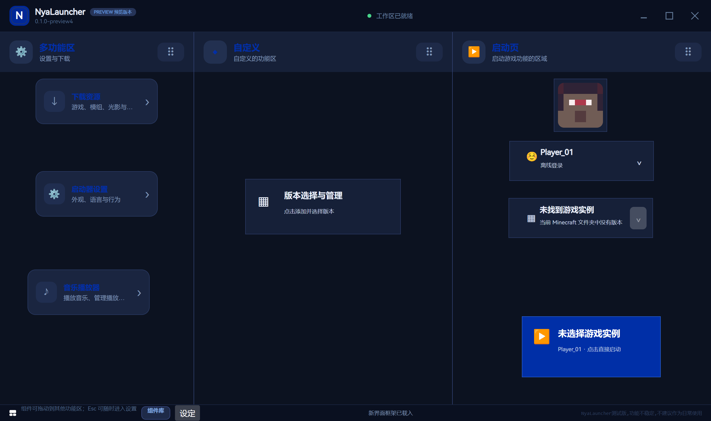
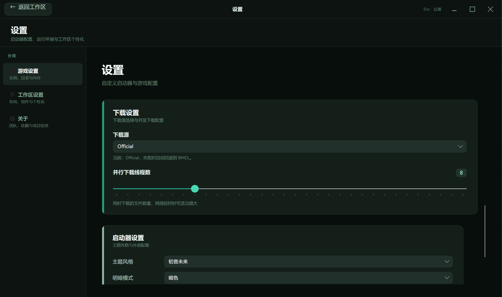
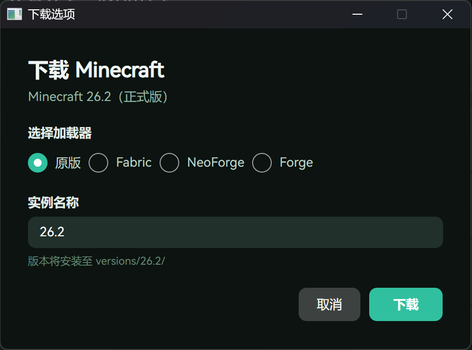
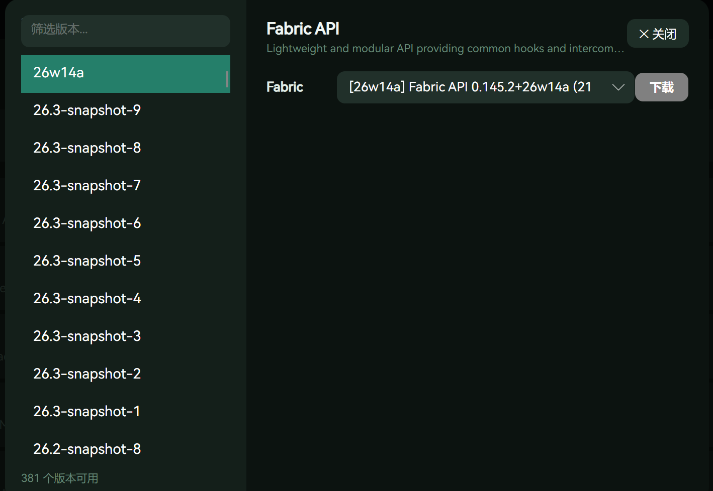
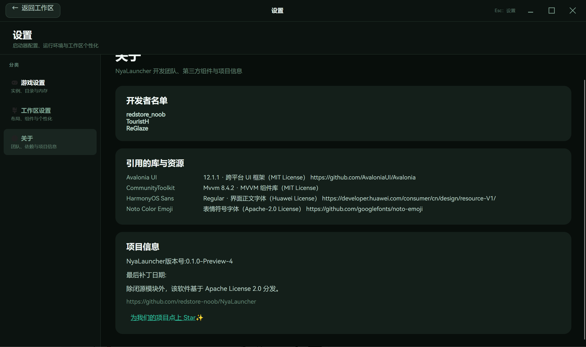
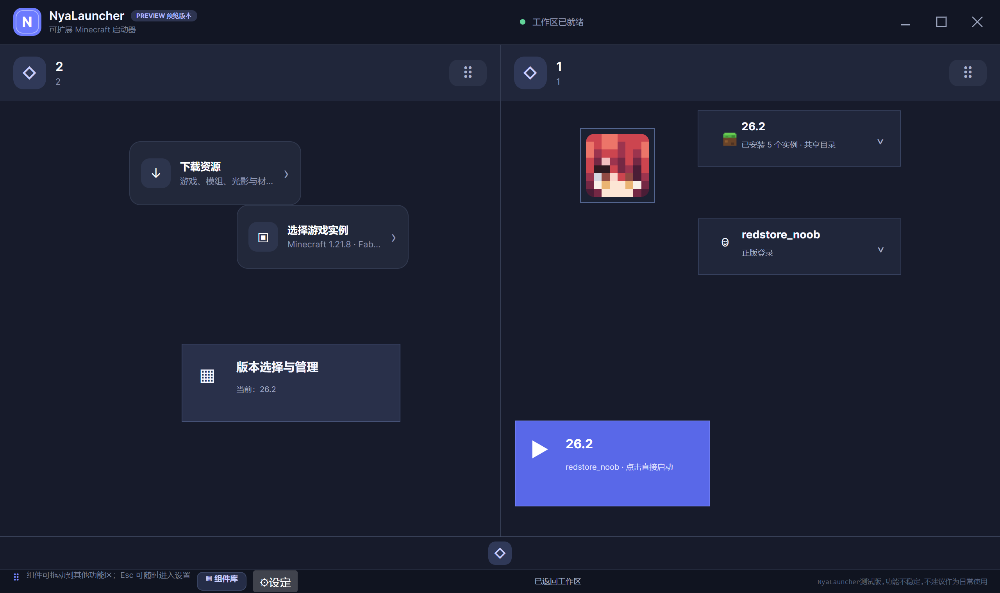
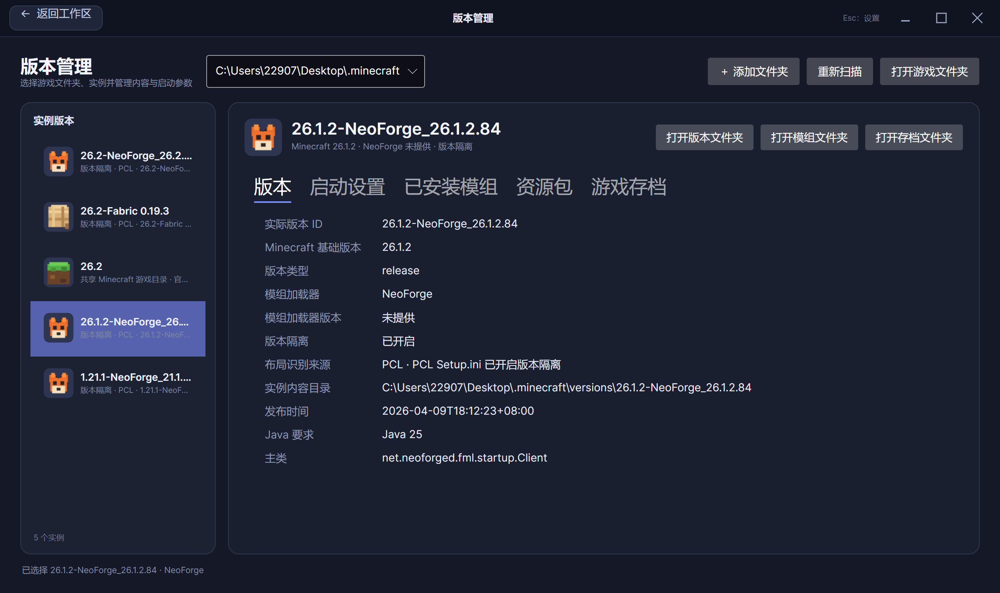
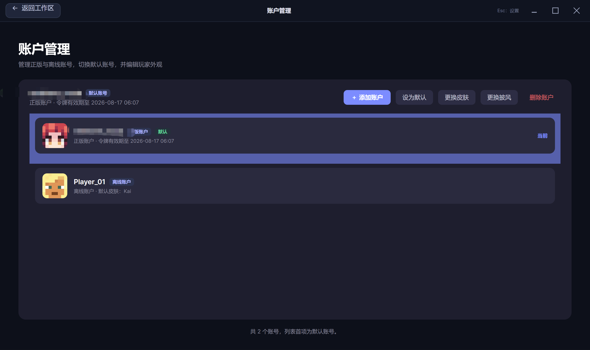

# 🐱 NyaLauncher

> 一个现代、跨平台的轻量 Minecraft 启动器，为自由而生。
<br>


---

## ✨ 简介

**NyaLauncher** 是一款基于 **Avalonia UI 12.1.1** 与 **.NET 10** 构建的跨平台 Minecraft 启动器。<br>
它不仅轻量、快速，更注重 **隐私保护** 与 **界面自定义**，让你在享受游戏的同时，拥有完全自主的控制权。<br>
NyaLauncher是一款自由软件，除了必要状态下保留的库文件之外,所有代码均遵循 [Apache License 2.0](LICENSE)。<br>
启动器不会进行任何用户不知情的遥测，不会侵犯用户任何的隐私，不会对用户作出任何功能限制。

---

## 📦 技术栈

| 组件            | 技术选型                           |
|-----------------|------------------------------------|
| UI 框架         | Avalonia UI 12.1.1                 |
| 运行时          | .NET 10                            |
| 组件扩展契约    | .NET 10，不依赖 Avalonia           |

---

## 🔧 项目结构

| 项目            | 相关功能                                                                                  |
|----------------|-------------------------------------------------------------------------------------------|
| NyaLauncher.Core         | 🐱NyaLauncher核心的启动功能集合                                                           |
| NyaLauncher.Avalonia          | NyaLauncher的前端界面，基于Avalonia技术构建                                               |
| NyaLauncher.Avalonia.Animations          | NyaLauncher的前端界面动画库，为NyaLauncher所准备                                          |
| NyaLauncher.Plugin.Abstractions    | 与 UI 框架无关的组件契约、几何、元素、运行时状态与校验                                    |
| NyaLauncher.MinecraftTokenCrypto    | (**由于算法不适宜公开原因，该库为闭源库**)关于Minecraft正版账户登录令牌的加密算法/存储    |

### NyaLauncher.Core 内部结构

| 目录               | 职责                                           |
|--------------------|------------------------------------------------|
| `Config/`          | 启动器配置持久化（全局设置、版本配置档案）       |
| `Content/`         | 游戏内容元数据解析（Mod/资源包/光影/存档）       |
| `Download/`        | Minecraft 版本下载与安装                         |
| `Launch/`          | 启动流程核心（实例管理、版本详情、内存策略等）   |
| `Launch/Auth/`     | 账号存储与认证模型                               |
| `Models/`          | 共享数据模型                                     |
| `Tools/`           | 通用工具方法                                     |
| `Ai/`              | AI 辅助功能                                      |
| `Logs/`            | 日志系统                                         |

### NyaLauncher.Avalonia 内部结构

| 目录               | 职责                                           |
|--------------------|------------------------------------------------|
| `Controls/`        | 自定义控件（DockWorkspace、InstanceListItem 等） |
| `Converters/`      | 值转换器                                         |
| `Dialogs/`         | 弹窗对话框（皮肤选择、披风选择、配置冲突等）     |
| `Framework/`       | 组件系统框架（功能区、拖拽、多边形组件运行时）    |
| `Pages/`           | 页面（启动页、版本管理、下载、设置等）           |
| `Themes/`          | 主题资源与工具（AXAML 主题字典、画刷、样式切换） |
| `Windows/`         | 独立窗口（个性化、组件库、任务详情）             |

---
## 🔃 更新计划

### 📝 更新命名规则
| 版本阶段 | 相关代表                                                                  |
|----------|---------------------------------------------------------------------------|
| beta     | 启动器编写阶段，完全不可用                                                |
| preview  | 启动器测试阶段，已经部分可用但不建议用于日常 (当前0.1.0preview-3所处阶段) |
| release  | 启动器正式版本，完全可用状态                                              |
| gp(特殊) | newgui分支时的特定版本号，对应为主分支preview                             |

### 待实现功能
- 插件功能(已成功在下游分支testplug验证完毕)
- 自定义主题(预计将在下一个preview版本发布)
- 多语言(实现时间待定)
- AI辅助翻译/查错(未知)
- 联机(???)
---

## 🛠️ 快速开始

### 🪟🍎🐧 环境要求

- [.NET 10 SDK](https://dotnet.microsoft.com/download/dotnet/10.0) 或更高版本
- 系统运行于Windows10+,MacOS Ventura+,Linux Kernel 5.0+
- 桌面运行时（Windows/macOS/Linux
> 鸿蒙移植计划待定。

### 🔧 克隆与构建

```bash
git clone https://github.com/redstore-noob/NyaLauncher.git
cd NyaLauncher
dotnet restore
dotnet build -c Release
```

---

## 📈 更新日志
近期改动

v0.1.0-preview4
- **项目结构大整理**：
  - 从 `Pages/` 中迁移 13 个纯后端服务/模型到 `Core`（GameInstanceStore、GameLaunchService、GameMemorySettings、GameContentMetadataService 等）
  - Avalonia 根目录散落的对话框归入 `Dialogs/`，独立窗口归入 `Windows/`，主题工具归入 `Themes/`
  - 提取实例列表项为独立自定义控件 `InstanceListItem`
  - 所有迁移类型添加了 XML 文档注释
  - `Pages/` 从 30 个文件精简到 18 个（仅保留真正的页面与 UI 相关逻辑）
- 下载界面:新增了Minecraft安装模组加载器的功能，新增了mod下载的功能，新增切换下载源功能
- 主界面:新增音乐播放器组件，玩累了听一会休息吧
- 设置界面:设置界面重制，新增关于选项卡
- 游戏:优化启动时的Java参数，重构了自动内存管理
- 样式:新增切换主题功能，支持浅色/暗色主题，字体切换为启动器内嵌Harmony Sans
- 增加账户管理功能，可以更便捷增删账户
- 启动:新增游戏补全功能
- 替换了部分图标为Fluent Icons
- 移除了Herobrine







v0.1.0-preview3
- newgui功能完善,已合并回main分支
- 增加了大量组件
- 对Core模块进行了小规模重构(进度:25/100%)
- 增加了Minecraft相关的下载功能
- 增加了Log功能,用于保存启动器/游戏运行时产生的运行文件
- 对于前端的硬编码样式问题进行了修复,其他问题进行了小优化
- 插件系统正在测试中,即将推出第一个可用API
- 后端重复的部分代码/死代码已移除
- animations模块移除部分代码,即将进行重构
- 更改各更新版本命名规则
- 移除了Herobrine




v0.1.0-gp2(newgui分支)

> `v0.1.0-gp2` 仅表示 v0.1.0 newgui 的第二次界面迭代，不写入 Core 版本号。<br>该版本不与main分支相关.

- 对GUI进行了重构(位于newgui分支)，主页变为可更改组件块，增加了自定义自由度(尚不完善，旧版GUI界面保存在main分支)
- 增加了离线启动、正版启动功能
- 对readme.md的bug进行了修复（?）
- 增加了多账户管理
- 增加配置保存功能，配置一次后终于能保留下来了😭
- 对Java搜索进行优化，修复了曾经存在的Java可启动但无法使用问题
- 移除了Herobrine


v0.1.0-pre1
- 将用户界面中的GUI拆分成独立库(NyaLauncher.Avalonia.Animations)
- 改善了出现的部分抽搐现象
- 移除了Herobrine

