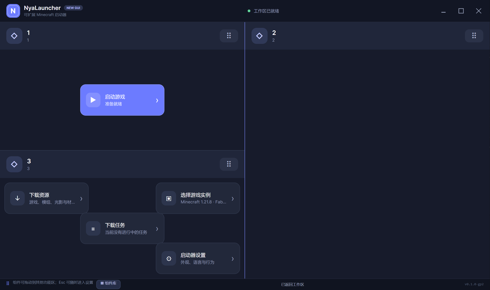
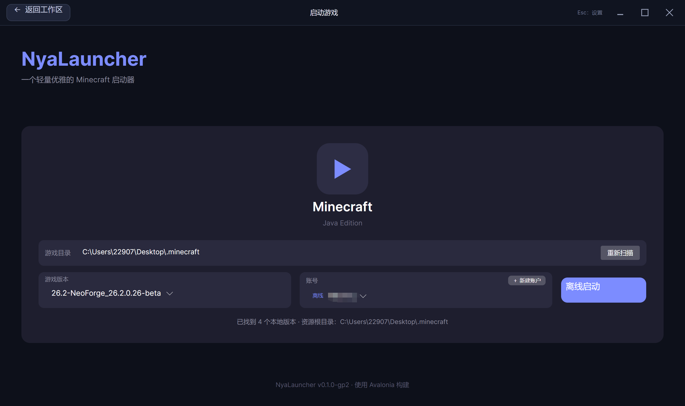
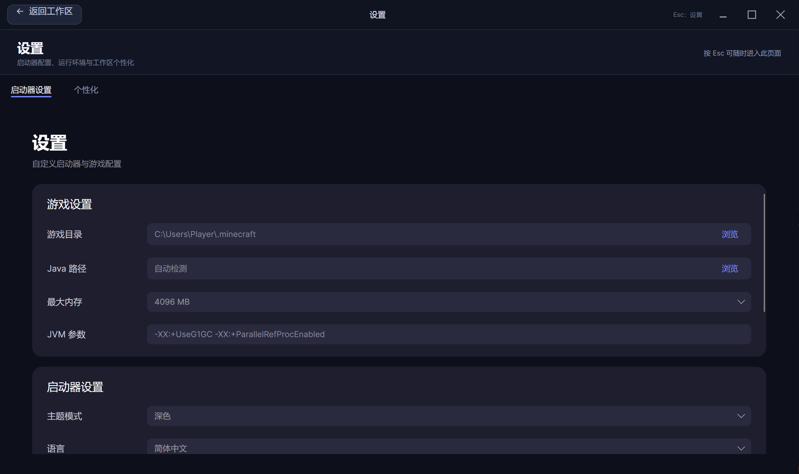
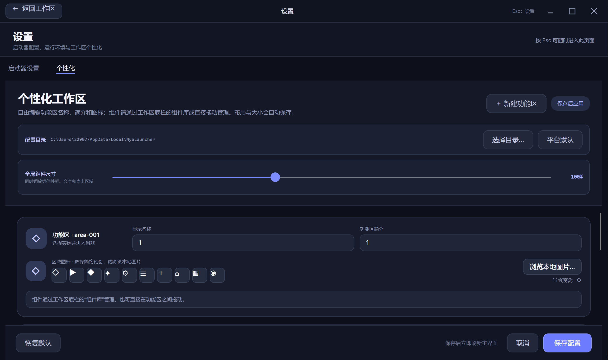
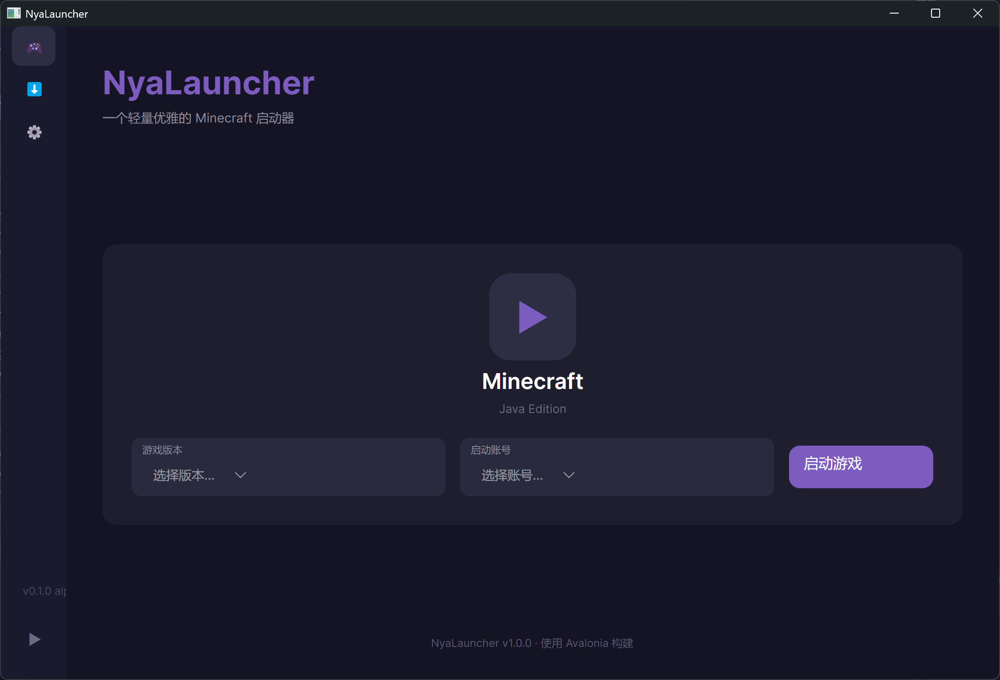

# 🐱 NyaLauncher

> 一个现代、跨平台的轻量 Minecraft 启动器，为优雅与自由而生。
<br>


---

## ✨ 简介

**NyaLauncher** 是一款基于 **Avalonia UI 12.1.1** 与 **.NET 10** 构建的跨平台 Minecraft 启动器。<br>
它不仅轻量、快速，更注重 **隐私保护** 与 **插件扩展性**，让你在享受游戏的同时，拥有完全自主的控制权。

---

## 🎯 核心特色

- 🚀 **跨平台支持** ——  Windows、macOS、Linux 三端支持，近乎一致的外貌。
- 🔌 **可扩展插件框架** —— 内置功能与第三方组件使用统一契约，并已接入插件扫描、授权、启停、设置与 Minecraft 实例扩展。
- 🛡️ **隐私优先** —— 无任何遥测，无第三方追踪，使用独特令牌加密技术，减少通过注册表等漏洞造成的令牌泄露。
- ⚡ **轻量高效** —— 基于 .NET 10 与 Avalonia 构建，按清晰职责组织功能，并支持按需扩展。
- 🎨 **现代 UI** —— 基于 Avalonia 的流畅设计，支持自定义。
- ✊ **完全原创** —— 该项目没有借用任何其他优秀启动器的代码，也不会进行刻意的模仿。
---
## 已实现功能与未实现功能
<table>
  <tr>
    <th>功能</th>
    <th>状态</th>
  </tr>
  <tr>
    <td>🚀 跨平台支持</td>
    <td><span>✅ 已完成</span></td>
  </tr>
  <tr>
    <td>⚡️ 流畅动效</td>
    <td><span>✅ 已完成</span></td>
  </tr>
  <tr>
    <td>⬡ 多边形组件框架</td>
    <td><span>✅ 基础框架已完成</span></td>
  </tr>
  <tr>
    <td>🎮 离线账号启动</td>
    <td><span>✅ 已完成</span></td>
  </tr>
  <tr>
    <td>📥 游戏版本下载</td>
    <td><span>✅ 基础安装流程已完成</span></td>
  </tr>
  <tr>
    <td>🔌 插件系统</td>
    <td><span>✅ v1 基础框架已完成</span></td>
  </tr>
  <tr>
    <td>🛡️ 隐私保护</td>
    <td><span>🚧 开发中</span></td>
  </tr>
  <tr>
    <td>🎭 自定义主题</td>
    <td><span>🚧 开发中</span></td>
  </tr>
  <tr>
    <td>🧩 Mod 管理</td>
    <td><span>🚧 开发中</span></td>
  </tr>
  <tr>
  <td>🎮 联机......?</td>
    <td><span>🤔 后续可能上线，且可能属于可选内容</span></td>
  </tr>
</table>

---

## ⬡ 多边形组件框架

- `NyaLauncher.Plugin.Abstractions` 提供不依赖 Avalonia 的公共契约，第三方扩展可以在不引用启动器 UI 实现的情况下描述组件。
- 支持使用 `[0,1]` 归一化坐标声明凸多边形或凹多边形轮廓，并分别声明首选、最小和最大尺寸。
- 组件可组合文本、可裁剪图片、按钮、进度条与下拉菜单；按钮和菜单项通过稳定动作 ID 调用组件实例提供的异步命令。
- 每个可交互组件由工厂创建独立运行时实例，并通过递增 `Revision` 的不可变状态快照更新文本、图片来源、进度、菜单项、启用、可见与不确定状态。
- 组件定义在注册前会检查 ID、几何、尺寸、元素、动作引用和进度范围，扩展可以通过稳定错误码定位问题。
- 宿主按真实多边形轮廓进行裁剪和命中测试，透明角不会抢占悬停与点击。
- 多边形组件与传统按钮组件进入同一组件目录，并复用工作区的拖放、相对定位、缩放、层级和侧栏能力。
- gp3 内置“账号选择”“游戏实例选择”“版本选择与管理”“启动游戏”“皮肤与披风”和“下载任务进度”组件；原有实例组件继续提供快速下拉切换，新的版本管理组件用于进入完整管理页面。
- `workspace.json` 只保存稳定组件 ID、所属功能区、相对坐标和层级；组件轮廓、内容定义与瞬时状态由组件提供方恢复。

> `v0.1.0-gp3` 已接入插件包发现、能力授权、启停与卸载、声明式设置、组件注册、实例事务操作和每次启动贡献。
> 插件作者可以从零定义自己的模组协议与 Java 加载器，而不依赖 Forge/Fabric 等现有加载器。完整包结构、API、示例和安全边界见
> [插件开发规范](NyaLauncher.Plugin.Abstractions/README.md)。插件在启动器进程内运行，能力授权不是操作系统安全沙箱。

---

## ⚙ 内存设置

- 设置页提供全局最大内存滑块，范围为 512 MiB 到当前设备的总物理内存，并以 256 MiB 为步进保存到 `config.json`。
- 勾选自动调整后会锁定全局滑块；每次开始启动游戏前重新读取当时的可用物理内存，为系统预留至少 2 GiB 且限制游戏不超过总内存的 75%，再得出本次全局内存上限。取消勾选后恢复滑块，并使用保存的手动上限。
- 实例启动设置中的最小与最大内存也使用滑块，并由“独立调整”开关控制。该开关默认关闭，此时两个滑块锁定且实例完全使用全局内存结果；开启后才读取实例滑块，最终 `-Xmx` 取实例上限和全局手动/自动上限中的较小值。若实例最小值超过最终上限，`-Xms` 会同步下调，保证 JVM 参数有效。

---

## ▦ 版本管理

- 新增独立的“版本选择与管理”多边形组件，短按进入管理页面，长按组件任意可见位置仍可拖动；原有游戏实例下拉组件保持不变。
- 管理页面可以添加并切换多个 Minecraft 根目录或 `versions/<版本>` 文件夹，并在所选文件夹中选择已安装实例；选择结果与启动页及快速下拉组件同步。
- 版本详情分别显示实例 ID、Minecraft 基础版本、模组加载器名称与准确版本、版本类型、发布时间、Java 要求和主类，并扫描实例实际使用目录中的模组、资源包、光影包与游戏存档。
- 实例选择组件、快速选择下拉菜单、版本列表和详情标题都会显示实例图标：原版、Fabric、Forge、NeoForge 等使用对应后备图标；PCL、MultiMC/Prism、CurseForge、Modrinth App、ATLauncher 整合包优先读取作者随实例或发布站点元数据提供的自定义本地/HTTPS 图标。所有实例图片按完整比例缩放，宽图或长图不会被裁掉，当前下拉项以角标标记选中状态。
- 模组、资源包、光影和地图列表以详情卡片显示。模组兼容 Fabric、Quilt、Forge、NeoForge 与旧版 Forge 元数据，读取名称、作者、版本、说明和包内图标；资源包与光影读取 `pack.mcmeta` 和包内图片；地图读取 `level.dat`、`icon.png`、Minecraft 版本、创建日期与最后游玩时间。缺失的非标准作者或版本字段会明确显示“未提供”。
- 原版实例的模组页会提示先安装模组加载器；已安装加载器但没有模组时正常显示 0 个模组；只有存在 `shaderpacks` 文件夹时才显示光影页。
- 可以为实例开启“独立调整”后通过滑块设置最小/最大内存；默认锁定并使用全局设置，开启后仍受全局策略约束，页面会实时显示实际最大值。
- 设置页的全局 Java、窗口尺寸及额外 JVM/游戏参数默认折叠在“高级选项”内。实例页也默认折叠高级选项，并默认开启“跟随全局”；跟随时显示且锁定全局值，关闭后才恢复并允许保存该实例自己的高级启动参数。
- 每个实例可以明确开启或关闭版本隔离；未显式设置时会依次读取 PCL 的 `VersionArgumentIndieV2`/`VersionArgumentIndie`，识别 HMCL、MultiMC/Prism、CurseForge、Modrinth App、ATLauncher 的实例标记与 `minecraft`/`.minecraft` 子目录，再按 `mods`、`resourcepacks`、`shaderpacks`、`saves`、`config`、`options.txt` 等通用内容特征回退。实例列表和详情页会显示布局识别来源与依据。
- 启动工作目录、模组、资源包、光影、配置、存档和文件夹快捷入口统一使用同一份布局解析结果；第三方实例使用嵌套 `minecraft`/`.minecraft` 内容目录时不会再错误读取外层版本目录。含标准 `versions` 元数据的第三方实例包装目录也可以直接添加。
- 可以直接添加带 `instance.cfg`、`minecraftinstance.json`、`profile.json` 或 `instance.json` 的外部实例目录并浏览其内容；这类实例的原生补丁元数据尚未转换为 NyaLauncher 启动格式，因此页面会禁用物理重命名与隔离切换，点击启动时给出明确提示，不会用错误参数尝试启动。
- 修改版本名称会真实重命名版本文件夹、同名 JSON 与 JAR，更新 JSON 内的 `id`，并同步更新其他版本对旧 ID 的 `inheritsFrom` 与 `jar` 引用；目标冲突或非法文件名会被拒绝。
- 页面提供快捷打开 Minecraft 根目录、版本文件夹、模组文件夹和存档文件夹的按钮；模组或存档文件夹不存在时会先创建再打开。
- 版本详情只会接收仍与当前文件夹和当前版本匹配的异步扫描结果；切换或刷新期间会立即清空旧详情。版本、模组和存档快捷入口会在点击时重新解析当前实例目录，Windows 下统一通过 Explorer 打开，避免复用旧实例路径或错误的目录 Shell 关联。

---

## 📥 游戏下载

- 下载页可从 Mojang 版本清单选择版本，并将版本元数据、游戏客户端、依赖库、资源索引和资源对象安装到当前 Minecraft 文件夹。
- 安装过程按“获取版本元数据、分析下载清单、下载游戏客户端、下载依赖库、下载资源索引、下载游戏资源、完成校验与安装”七个阶段显示。
- 进度窗口实时显示当前阶段、说明、总进度、下载速度、已下载字节和文件数量，并支持取消当前任务。
- 下载文件会校验 SHA-1；已存在且校验通过的文件可直接复用，新文件先写入临时文件再原子替换，最多并行下载 8 个文件。
- 开始下载后，右下角显示绿色下载悬浮入口；下载和启动同时进行时优先显示并打开下载进度，窗口左侧可切换到启动日志。
- 当前查看下载进度时，下载任务结束后窗口会自动关闭；已经切换到启动日志的窗口不会因任务结束自动关闭。启动日志只能在至少开始过一次游戏启动后从任务悬浮入口打开。

---

## 🎮 离线启动

- 支持扫描 Minecraft 根目录及 `versions/版本号` 独立实例目录。
- 支持离线用户名校验与稳定 UUID 生成，不读取或依赖在线账号令牌。
- 支持版本继承、现代与旧版启动参数、操作系统规则及 classpath 构建。
- 支持安全解压 natives，并在游戏退出后清理临时文件。
- 根据版本 JSON 的最低 Java 要求，从 Minecraft runtime、`NYALAUNCHER_JAVA`、`JAVA_HOME` 或 `PATH` 自动选择最接近要求的兼容版本；显式配置时允许使用更高主版本。
- classpath 合并会区分普通库、`natives-*`、`unsafe` 等 Maven classifier，避免同名 LWJGL 依赖相互覆盖。
- 启动页提供目录扫描、版本选择、离线用户名、运行状态和退出代码提示。
- 启动任务运行期间复用全局右下角圆形任务入口；点击可查看本次启动最近 2000 行 Java 标准输出与错误日志。启动或下载任务结束后入口自动隐藏，已打开的启动日志窗口不会随游戏进程结束自动关闭。

> 离线账号不能进入要求正版认证的服务器；启动前需确保目标版本、依赖库和资源文件已经完整安装。

---

## 📦 技术栈

| 组件            | 技术选型                        |
|----------------|-------------------------------|
| UI 框架         | Avalonia UI 12.1.1            |
| 运行时          | .NET 10                       |
| 组件扩展契约     | .NET 10，不依赖 Avalonia       |

---

## 🔧 项目结构

| 项目            | 相关功能                        |
|----------------|-------------------------------|
| NyaLauncher.Core         | 🐱NyaLauncher核心的启动功能集合              |
| NyaLauncher.Avalonia          | NyaLauncher的前端界面，基于Avalonia技术构建                       |
| NyaLauncher.Avalonia.Animations          | NyaLauncher的前端界面动画库，为NyaLauncher所准备      |
| NyaLauncher.Plugin.Abstractions    | 与 UI 框架无关的第三方组件契约、几何、元素、运行时状态与校验      |
| NyaLauncher.MinecraftTokenCrypto    | (**由于某些原因，该库不公开**)关于Minecraft正版账户登录令牌的加密算法      |

---

## 🛠️ 快速开始

### 环境要求

- [.NET 10 SDK](https://dotnet.microsoft.com/download/dotnet/10.0) 或更高版本
- 系统运行于Windows10+,MacOS Ventura+,Linux Kernel 5.0+
- 桌面运行时（Windows/macOS/Linux

### 克隆与构建

```bash
git clone https://github.com/your-username/NyaLauncher.git
cd NyaLauncher
dotnet restore
dotnet build -c Release
```
> 再次声明:该项目目前仍处于不完善状态，任何可能出现的使用中/构建时的问题全部在允许的范围内。

---

## 更新日志
近期改动

v0.1.0-gp3
- 新增多边形组件基础框架，组件可以声明自定义凹/凸多边形轮廓与独立尺寸。
- 新增不依赖 Avalonia 的组件扩展契约，包含定义构建、注册、实例工厂、运行时状态和校验接口。
- 为组件提供文本、可按归一化坐标或精确像素区域裁剪的图片、按钮、进度条和下拉菜单元素；图片支持本地绝对路径、HTTPS 来源、像素化显示与运行时切换，菜单项可通过稳定动作 ID 传递参数并调用异步命令。
- 组件视觉与指针命中均遵循真实多边形轮廓，透明角不会错误触发悬停。
- 多边形组件接入组件目录与工作区宿主，并提供可拖入的“下载任务进度”六边形示例，复用拖放、自由布局、全局缩放、悬停层级和侧栏能力。
- 使用多边形框架将旧账号按钮重做为小型长条账号选择组件，显示当前账号名称和正版、离线或第三方登录模式；下拉菜单固定提供“添加账号”，并列出已保存账号供快速切换。
- 账号组件、启动页和设置页现在共享同一个当前账号顺序；新增或切换账号会写入 `config.json`，旧 `account` 组件 ID 会迁移到新组件 ID。
- 新增小型长条“游戏实例选择”组件：显示当前实例名称，右侧下拉菜单列出所选 Minecraft 文件夹内的全部已安装版本；组件与启动页共享选择状态并持久化当前实例，目录扫描在后台执行。
- 新增独立“版本选择与管理”组件及页面：可维护多个版本文件夹，查看版本、模组、资源包和可用光影，编辑并实际应用启动参数，快捷打开相关目录；版本名称修改会直接重命名文件夹、JSON、JAR 并修正继承引用。
- 修复无活动任务时右下角任务入口仍然显示的问题；完成、失败、取消或游戏退出后入口会隐藏，但已经打开的启动日志仍保留。
- 为每个实例新增明确的版本隔离设置并修复实例列表的重复版本显示；隔离开启时，启动工作目录、模组、资源包、光影、配置和存档统一使用 `versions/<当前版本>`，列表同时标明“版本隔离”或“共享目录”。
- 修复仅从 Minecraft 根目录进入时无法识别第三方启动器隔离实例的问题；新增可追溯的通用布局解析器，兼容 PCL、HMCL、MultiMC/Prism、CurseForge、Modrinth App、ATLauncher 的常见标记与嵌套内容目录，并以实际内容结构作后备检测；版本详情同时显示识别来源、存档列表和打开存档文件夹入口。
- 支持把带已知元数据标记的第三方实例目录直接加入版本管理并只读浏览独立内容；在完成原生补丁元数据转换前明确阻止错误的直接启动和物理重命名。
- 修复版本详情和快捷文件夹入口仍可能持有上一个实例路径的问题；异步详情增加当前选择校验，刷新时清除旧数据，所有内容入口点击时重新解析当前实例，并在 Windows 上显式交给 Explorer 打开。
- 完成全局与实例内存设置：全局最大内存和实例最小/最大内存均改为按物理内存动态定界的滑块；实例滑块默认由“独立调整”开关锁定并使用全局结果，自动模式会锁定全局滑块并在每次启动前按剩余可用内存计算安全上限，启动日志记录最终内存决策。
- 版本详情新增 Minecraft 基础版本和模组加载器准确版本；设置页与实例页的 Java、窗口尺寸、JVM 和游戏参数统一收进默认折叠的“高级选项”。全局高级设置可持久化，实例默认跟随并锁定全局值，关闭跟随后才允许独立编辑，启动时会按该选择实际应用。
- 为实例和内容管理新增图标与详细元数据：实例按加载器显示后备图标并优先采用第三方整合包自定义图标；模组、资源包、光影和地图显示名称、作者、版本/日期、说明及可用图标。JAR/ZIP 与 `level.dat` 扫描在后台执行，压缩包图片经过大小限制后提取到内容图标缓存。
- 修复整合包宽图/长图使用填充裁剪而显示不全，以及快速实例选择下拉菜单只有字符而没有实例图片的问题；菜单项图片沿用组件图片安全边界，按完整比例显示并保留独立的选中角标。
- 使用多边形框架重写“启动游戏”组件：短按组件任意非交互区域会直接使用当前账号启动已选实例，准备、运行、失败和退出状态会实时回写组件；启动管线与启动页共用，避免重复启动。
- 新增启动器右下角圆形任务状态入口，游戏开始准备后自动显示；点击可打开实时启动日志，查看有界保存的 Java 标准输出、错误输出与退出代码。
- 完成游戏版本的实际下载与安装流程，覆盖版本元数据、客户端、依赖库、资源索引和资源对象；安装器提供八路并发、SHA-1 校验、已有文件复用、临时文件写入与原子替换。
- 下载任务接入统一任务悬浮入口和详情窗口，实时展示七个阶段、总进度、下载速度、字节与文件数量；下载与启动并行时下载优先，左侧可切换启动日志，下载视图在任务结束后自动关闭而启动日志保持打开。
- 新增小型“皮肤与披风”头像框组件：正版登录可选择 PNG、确认 Steve 粗手或 Alex 纤细模型并上传皮肤，也可从账号已有披风中启用或停用披风；离线登录可选择 Steve、Alex、Noor、Sunny、Ari、Zuri、Makena、Kai 或 Efe，选择结果随账号持久化。
- 工作区配置升级到版本 6，已有 gp3 工作区会按迁移版本一次性加入皮肤头像、游戏实例选择和版本管理组件，并把旧 `launch` 组件原地替换为新启动组件；用户之后主动移除时不会被重复恢复。
- 恢复组件原有交互：短按继续使用按钮或菜单，长按组件任意可见位置即可拖动，不再显示或要求固定拖动把手。
- 修复首次读取离线默认皮肤时阻塞界面以及未配置 Minecraft 目录时头像为空的问题；目录扫描、JAR 读取和后备 PNG 生成改为可取消的后台任务，并按目录缓存整套九款纹理。
- 修复 Mojang 档案响应中的 HTTP 纹理地址被错误过滤、64×32 兼容皮肤被错误裁剪、帽子层背景遮挡脸部以及披风对话框跨线程无法打开的问题；正版头像现在兼容 64×32 与 64×64 皮肤，账号已有披风可正常选择。
- 工作区继续只按稳定组件 ID 保存所属功能区、相对坐标和层级，不持久化插件定义或瞬时进度。
- 改进配置目录迁移：可采用目标目录已有配置，并选择删除或备份原配置；切换后同步刷新工作区与启动配置。
- 将 newgui 前端版本统一为 `v0.1.0-gp3`，Core 启动器版本保持 `0.1.0`。

v0.1.0-gp2

> `v0.1.0-gp2` 仅表示 v0.1.0 newgui 的第二次界面迭代，不写入 Core 版本号。

- 对GUI进行了重构(位于newgui分支)，主页变为可更改组件块，增加了自定义自由度(尚不完善，旧版GUI界面保存在main分支)
- 增加了离线启动、正版启动功能
- 对readme.md的bug进行了修复（?）
- 增加了多账户管理
- 增加配置保存功能，配置一次后终于能保留下来了😭
- 对Java搜索进行优化，修复了曾经存在的Java可启动但无法使用问题
- 移除了Herobrine





v0.1.0-pre1
- 将用户界面中的GUI拆分成独立库(NyaLauncher.Avalonia.Animations)
- 改善了出现的部分抽搐现象

